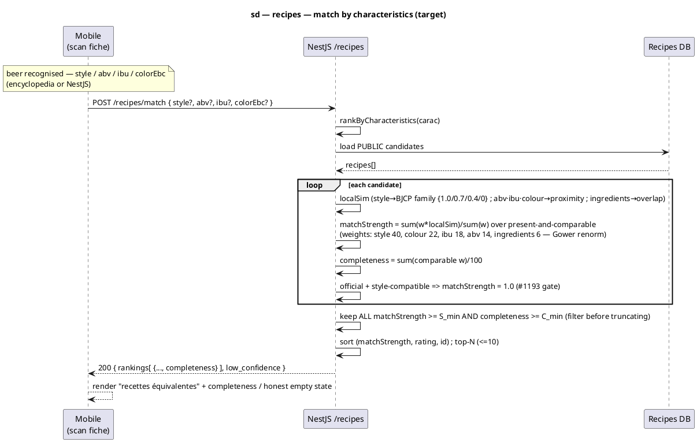

# Sequence diagram — recipes — Match community recipes to a beer (by characteristics)

> **Feature**: epic #740; matching algorithm #699; scan cutover #1186 (this decoupling); matcher v2 **ADR-0016** (#1198).
> **Code**: `src/recipe/services/recipe-matching.service.ts`, `src/recipe/controllers/recipe.controller.ts`; mobile `features/scan/data/recipe-matching.api.ts`.
> **ADRs**: ADR-0005 (recipes are product data → NestJS), ADR-0013 (conception is the contract), **ADR-0016** (weighted criteria + completeness ratio + BJCP style families — the scoring this diagram now reflects).
> **See also**: `../beer-encyclopedia/08-sequence-mobile-scan.md` (the scan fiche that triggers this), `../../traceability-matrix.md`.

## Context

The scan fiche ("recettes équivalentes") ranks community recipes against the **scanned beer**.
The match endpoint takes the beer's **characteristics directly** (`style`, `abv`, `ibu`,
`colorEbc`), not a `scan_catalog_items` id. Reason: the scan cutover (#1186) makes the mobile
resolve a barcode against the **beer-encyclopedia**, whose `BeerRead` carries a Python `beers`
UUID that is **absent** from NestJS `scan_catalog_items` — so the legacy
`GET /recipes/match/:beerId` (which `findOne`s a scan-catalog row by id) 404s for every
encyclopedia-sourced beer. Passing the characteristics removes that coupling and keeps matching
working for **any** source (encyclopedia, NestJS, or a future one).

The legacy id-based route stays as a thin wrapper (load the scan-catalog row → delegate to the
same scorer) until the NestJS scan path is retired (#1186 step 2).

**Scoring — matcher v2 (ADR-0016).** This diagram reflects the v2 scoring, *not* the original
`style×50 + abv×25 + ibu×15 + colour×10` exact-name scheme. The v2 changes (all from ADR-0016):

1. **Style is graded by BJCP family**, not name-equality: `styleSimilarity ∈ {1.0 same style,
   0.7 same family, 0.4 same colour+strength tier, 0 else}` — so *Blonde Ale ≈ Kölsch* no longer
   scores 0.
2. **Full-data weights** are Style **40**, Colour **22**, IBU **18**, ABV **14**, Ingredients **6**.
3. **Match strength** is the Gower-renormalised weighted similarity: a criterion absent on either
   side drops out of **both** numerator and denominator (never scored 0, never imputed).
4. **Completeness ratio** = comparable weight / 100 is a **separate** confidence signal (how much
   of the full picture the comparison used).
5. **Acceptance threshold**: a candidate is shown only when `matchStrength ≥ S_min` **and**
   `completeness ≥ C_min`; otherwise the section shows an honest empty state instead of a
   misleading closest match.

## Diagram (Mermaid)

```mermaid
sequenceDiagram
  autonumber
  participant M as Mobile (scan fiche)
  participant API as NestJS /recipes
  participant DB as Recipes DB

  Note over M: beer recognised — has style / abv / ibu / colorEbc<br/>(from the encyclopedia or NestJS)
  M->>API: POST /recipes/match { style?, abv?, ibu?, colorEbc? }
  API->>API: rankByCharacteristics(carac)
  API->>DB: load PUBLIC candidate recipes
  DB-->>API: recipes[]
  loop each candidate
    API->>API: localSim per criterion<br/>style → BJCP family {1.0/0.7/0.4/0} ; abv·ibu·colour → numeric proximity ; ingredients → overlap
    API->>API: matchStrength = Σ[w×localSim] / Σ[w] over present-and-comparable criteria<br/>(weights: style 40, colour 22, ibu 18, abv 14, ingredients 6 — Gower renorm)
    API->>API: completeness = Σ[comparable w] / 100
    API->>API: official + style-compatible ⇒ matchStrength = 1.0 (#1193 gate)
  end
  API->>API: keep ALL candidates with matchStrength ≥ S_min AND completeness ≥ C_min<br/>(filter the full set BEFORE truncating)
  API->>API: sort desc (matchStrength, then rating, then id) ; take top-N (≤10)
  API-->>M: 200 { rankings[ { …, completeness } ], low_confidence }
  M-->>M: render "recettes équivalentes" + completeness<br/>OR honest empty state if none pass the threshold
```

_Same flow in **PlantUML** (keep synchronised with the Mermaid block)._



## Notes

- **Inputs (all optional, all nullable).** `style: string`, `abv: number`, `ibu: number`,
  `colorEbc: number`. The mobile maps EBC ↔ the API's colour unit consistently with the scan
  fiche (`ScanCatalogItem.colorEbc`). A missing criterion **drops out of both numerator and
  denominator** of the match-strength ratio (Gower renormalisation) — so a beer with only
  style + abv still ranks, on those two criteria, with its completeness flagged.
- **Scoring — matcher v2 (ADR-0016).** Per-criterion local similarity × full-data weight,
  renormalised over present-and-comparable criteria:
  - **Style → BJCP family** (ADR-0016 D2): `1.0` same style, `0.7` same family, `0.4` same
    colour+strength tier, `0` else. Replaces the old exact/substring `scoreStyle` so
    *Blonde Ale ≈ Kölsch* (both Pale Ale family) no longer scores 0.
  - **Weights** (ADR-0016 D1): style **40**, colour **22**, ibu **18**, abv **14**,
    ingredients **6**.
  - **`matchStrength`** (ADR-0016 D3) = `Σ[w×localSim] / Σ[w]` over present-and-comparable
    criteria, `∈ [0..1]`.
  - **`completeness`** (ADR-0016 D4) = `Σ[comparable w] / 100` — a **separate** confidence
    signal returned alongside each ranking, distinct from match strength.
- **Acceptance threshold (ADR-0016 D5).** A candidate is shown only when
  `matchStrength ≥ S_min` **AND** `completeness ≥ C_min` (env-tunable; calibrate on real
  OpenFoodFacts coverage). **The threshold filters the full scored set *before* the top-N
  truncation** — so a reliable match ranked just below a high-strength-but-low-completeness
  candidate is never hidden by the cut. Below the threshold, the section renders an honest empty state
  (*"Pas encore de recette équivalente fiable pour cette bière"* + invite to contribute),
  not a misleading closest match. `low_confidence` is retained in the envelope for
  backward-compatibility but the empty-state replaces the old "show closest + banner".
- **Style-gated official promotion (#1193, ADR-0016 D6).** The official-recipe shortcut
  (matchStrength = 1.0) applies **only when the official is style-compatible** — refined to
  **same BJCP family or better** (style local similarity ≥ 0.7), not merely the same
  colour/strength tier (0.4). An off-family official (e.g. an IPA for a Leffe Blonde — same
  pale/standard tier, 0.4) is ranked on its honest similarity instead and does not bypass the
  D5 threshold. Same-family officials stay promoted.
- **Backward compatibility.** `GET /recipes/match/:beerId` stays (same request/response
  contract): it loads the `scan_catalog_items` row, then calls `rankByCharacteristics(row)`.
  Removed when the NestJS scan path is retired (#1186 step 2). The **interface** is unchanged;
  the **ranking** reflects the style-gated official promotion (#1193) for both routes.
- **Why not key off the beer id.** Identity is not a matching input; coupling to
  `scan_catalog_items` is exactly what blocks the encyclopedia cutover. Characteristics are
  source-agnostic.
- **Style → BJCP family mapping (prerequisite).** D2 needs every seeded style and every
  free-text recipe style normalised to a BJCP family + colour/strength tier (ADR-0016 Appendix).
  The encyclopedia `Style` model carries `category`/`srm`/`abv` but **no `family`** — that field
  (or an alias lookup) must be modelled in the encyclopedia class diagram before coding.
- **Conformance.** The code (`recipe-matching.service.ts` + the controller + the mobile data
  layer) must satisfy this contract and the ADR-0016 scoring: a characteristics endpoint, the
  BJCP-family-graded weighted-renormalised scorer shared with the legacy route, `completeness`
  returned per ranking, and the D5 threshold/empty-state. Implementation follows validation of
  this diagram and ADR-0016.
