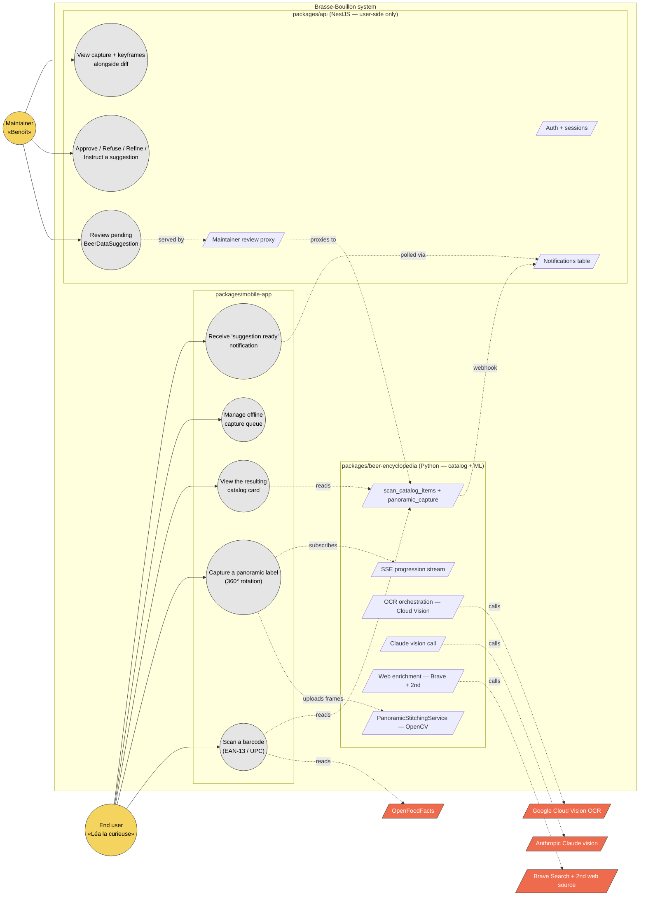

# Use case diagram — scan — actors and goals

> **Feature**: epic [#751](https://github.com/benoit-bremaud/brasse-bouillon/issues/751) — Smart bottle photo capture (panoramic label) + epic [#934](https://github.com/benoit-bremaud/brasse-bouillon/issues/934) (barcode enrichment).
> **Source specs**: [`docs/architecture/specs/scan-algorithms.md`](../../specs/scan-algorithms.md) §2 (decision tree) and §3 (panoramic algorithm).
> **Related ADRs**: [ADR-0002](../../decisions/0002-centralized-nestjs-backend.md), [ADR-0005](../../decisions/0005-backend-split-encyclopedia-vs-product.md).
> **Decisions captured**: D1–D7 (`scan-algorithms.md`, 2026-05-08) — *to be promoted to ADR-0006…*.

## Context

Highest-level view of who interacts with the scan feature and what each actor is trying to achieve. Boundaries between **internal services** (mobile, NestJS API, Python beer-encyclopedia) and **external providers** (Cloud Vision, Claude, OpenFoodFacts, Brave) are made explicit, because ADR-0005 splits backend ownership and ADR-0002 forbids the mobile bundle from calling external providers directly.

This diagram does **not** show timing (see [02a sequence — burst capture](02a-sequence-burst-capture-frame.md) + [02b sequence — end-to-end pipeline](02b-sequence-end-to-end-pipeline.md)) nor data structures (see [04 class diagram](04-class.md)).

## Diagram

## Notes

### Actor / use-case anti-patterns this diagram makes visible

- **No actor-to-external arrow.** End user and maintainer never talk directly to Cloud Vision, Claude, OpenFoodFacts, or Brave. Per [ADR-0002](../../decisions/0002-centralized-nestjs-backend.md), the mobile app calls **only** the project's own backends. If a future implementation wires a direct `fetch(cloudvision.googleapis.com/...)` from `packages/mobile-app/`, it violates this diagram and ADR-0002. The [component diagram](03-component.md) makes the egress point (`packages/mobile-app/src/core/http/http-client.ts`) explicit.

- **Backend ownership split — ADR-0005.** Anything *catalog* (`scan_catalog_items`, `panoramic_capture`, OCR orchestration, OpenCV stitching, Claude vision, Brave web search) lives in Python. NestJS keeps **only** auth + notifications + maintainer-review proxy. The "scan" module currently in NestJS is **transitional** and on a deprecation roadmap. Any sub-issue under #751 that lands new catalog code in `packages/api/src/scan/` must be flagged for migration to `packages/beer-encyclopedia/`.

- **Maintainer ≠ end user.** The end user (`Buyer`) and the maintainer (`Maintainer`) are distinct actors with disjoint use-case sets. Conflating them in the code (one Permission class, one route) would obscure the fact that approve/refuse/refine/instruct lives behind a maintainer-only gate.

### What this diagram intentionally omits

- **Real-time mechanics of the burst capture** (per-frame loop, hash, blur check, gyro). See [02a sequence — burst capture frame](02a-sequence-burst-capture-frame.md).
- **End-to-end pipeline timing** (upload → stitching → OCR → AI → web verification → suggestion). See [02b sequence — end-to-end pipeline](02b-sequence-end-to-end-pipeline.md).
- **State of a capture session** (PreCapture → Capturing → Uploading → …). See [05 state — capture session](05-state-capture-session.md).
- **Data fields and PII**. See [06 data flow](06-data-flow.md).

### Open questions surfaced by this diagram

- The `notifications` table sits in NestJS today (ADR-0005). Should the Python beer-encyclopedia expose a `subscribe` interface for the maintainer's UI to read directly, bypassing the NestJS proxy? Tracked as part of the ADR-0005 §Roadmap deprecation of the NestJS `scan/` module.
- The "Manage offline capture queue" use-case (`UC4`, [D7](../../specs/scan-algorithms.md#phase-25--offline-upload-queue-decision-d7-2026-05-08)) currently has no maintainer-facing visibility. If a user's capture sits queued for 7 days then expires, the maintainer never sees it. Should a `dropped_offline_capture` metric land in #942 cost monitoring? Follow-up.
