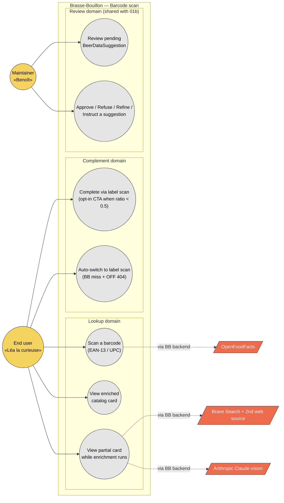

# Use case diagram — scan / barcode — actors and goals

> **Feature**: epic [#934](https://github.com/benoit-bremaud/brasse-bouillon/issues/934) — Barcode enrichment with maintainer validation.
> **Source specs**: [`docs/architecture/specs/scan-algorithms.md`](../../specs/scan-algorithms.md) §2 (decision tree) and §1 (vocabulary).
> **Related ADRs**: [ADR-0002](../../decisions/0002-centralized-nestjs-backend.md), [ADR-0005](../../decisions/0005-backend-split-encyclopedia-vs-product.md).
> **Companion**: [`01b-use-case-panoramic.md`](01b-use-case-panoramic.md) for the panoramic-scan epic #751.

## Context

Highest-level view of **who interacts with the barcode-scan feature and to do what**. Scoped to epic #934 (barcode enrichment) only — the panoramic / label scan use cases live in the companion [01b](01b-use-case-panoramic.md), per the *one epic = one use case diagram* rule.

The barcode flow is the **default first action** of the scan feature: the user scans an EAN-13 / UPC code, the app queries Brasse-Bouillon's own catalog + the OpenFoodFacts public database, and depending on the **completeness ratio** of the resulting card, the user is offered an optional panoramic-scan complement (or auto-switched to it if both sources returned nothing). The decision tree is captured in `scan-algorithms.md` §2.

This diagram answers *"who wants what?"*. It deliberately does **not** show:

- **Backend structural decomposition** (NestJS API ↔ Python beer-encyclopedia) — see [03 component diagram](03-component.md).
- **Temporal flow** (barcode read → BB lookup → OFF lookup → completeness ratio → enrichment) — see [02b sequence — end-to-end pipeline](02b-sequence-end-to-end-pipeline.md).
- **Data structures** (`scan_catalog_items`, `beer_data_suggestions`) — see [04 class diagram](04-class.md).

## Diagram

## Notes

### UML 2.5 orthodoxy applied

- **Use cases grouped by domain** (`Lookup`, `Complement`, `Review`). The Mobile / NestJS / Python decomposition lives in [03 component diagram](03-component.md).
- **`Review domain` is shared** with [01b-use-case-panoramic.md](01b-use-case-panoramic.md). The maintainer reviews suggestions independently of how they were created (barcode-enrichment seed vs panoramic-scan seed). UML allows recurring use cases across diagrams when each diagram is scoped to a different epic — the diagrams are different *views*, not different *systems*.

### Anti-patterns this diagram makes visible

- **No actor-to-external arrow.** End user never talks directly to OpenFoodFacts, Brave, or Claude. Per [ADR-0002](../../decisions/0002-centralized-nestjs-backend.md), the mobile app calls only Brasse-Bouillon's own backends. The egress point is made explicit by the [03 component diagram](03-component.md).
- **`UC5 — Auto-switch to label scan` is still actor-initiated.** Although the *trigger* is a system condition (BB miss + OFF 404), the *use case* — performing a panoramic capture — is performed by the user. The banner *"Aucun code-barre reconnu — capture l'étiquette"* (per spec §5 UX copy) makes the auto-switch explicit. The user's act of completing the panoramic capture is what the use case captures.
- **`UC4` and `UC5` are mutually exclusive at runtime.** `UC4` (opt-in CTA) fires when ratio is partial; `UC5` (auto-switch banner) fires when there is no data at all. They never co-occur for the same scan. They appear as two distinct use cases because they reflect two distinct user experiences (free choice vs forced fallback).

### Cross-diagram references

- `UC4` and `UC5` both lead to the panoramic flow detailed in [01b-use-case-panoramic.md](01b-use-case-panoramic.md). They are the entry points from the barcode side; the panoramic capture itself is described there.
- `UC6` and `UC7` mirror the *Review domain* of [01b](01b-use-case-panoramic.md). The same maintainer use cases serve both seeds — barcode-enrichment and panoramic.

### Open questions surfaced by this diagram

- The completeness-ratio threshold is hard-coded to `SCAN_COMPLETENESS_THRESHOLD = 0.5` (env var). Should the maintainer be able to see / tune this from the review screen? Tracked as part of #942 cost monitoring follow-up.
- `UC5 — Auto-switch` currently has no user-facing toggle (the user cannot disable it). Is that intentional? Document under #944 follow-up if a power-user setting is wanted.
- The barcode flow today is implemented in `packages/api/src/scan/` (NestJS). Per [ADR-0005](../../decisions/0005-backend-split-encyclopedia-vs-product.md), the catalog work should migrate to the Python beer-encyclopedia. The diagram does not show this migration timeline — it lives in the [03 component diagram](03-component.md).
