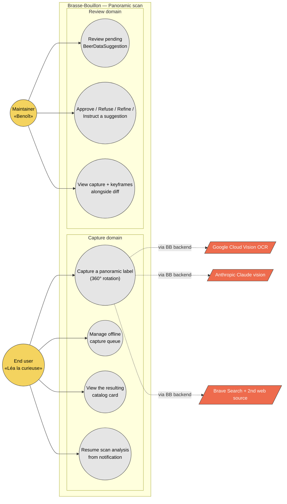

# Use case diagram — scan / panoramic — actors and goals

> **Feature**: epic [#751](https://github.com/benoit-bremaud/brasse-bouillon/issues/751) — Smart bottle photo capture (panoramic label).
> **Source specs**: [`docs/architecture/specs/scan-algorithms.md`](../../specs/scan-algorithms.md) §3 (panoramic algorithm) and §5 (UX copy).
> **Related ADRs**: [ADR-0002](../../decisions/0002-centralized-nestjs-backend.md), [ADR-0005](../../decisions/0005-backend-split-encyclopedia-vs-product.md).
> **Decisions captured**: D1–D7 (`scan-algorithms.md`, 2026-05-08) — *to be promoted to ADR-0006…*.
> **Companion**: [`01a-use-case-barcode.md`](01a-use-case-barcode.md) for the barcode-scan epic #934.

## Context

Highest-level view of **who interacts with the panoramic-scan feature and to do what**. The diagram is scoped to epic #751 (panoramic / label scan) only — the barcode-scan use cases (epic #934) live in the companion [01a](01a-use-case-barcode.md) so each epic has its own use-case diagram, per UML 2.5 orthodoxy.

This diagram answers *"who wants what?"*. It deliberately does **not** show:

- **Backend structural decomposition** (Mobile / NestJS / Python encyclopedia split) — that lives in the [03 component diagram](03-component.md). Mixing use-case grouping with package boundaries is the UML 2.5 anti-pattern the skill `uml-diagram-new` warns about.
- **Temporal flow** (frame-by-frame loop, OCR escalation, SSE streaming) — see [02a sequence — burst capture](02a-sequence-burst-capture-frame.md) and [02b sequence — end-to-end pipeline](02b-sequence-end-to-end-pipeline.md).
- **Data structures** — see [04 class diagram](04-class.md).
- **Lifecycle of a capture session** — see [05 state — capture session](05-state-capture-session.md).
- **Field-level data + PII** — see [06 data flow](06-data-flow.md).

## Diagram

## Notes

### UML 2.5 orthodoxy applied (refactor 2026-05-18)

This diagram was refactored from a first draft that grouped use cases by backend package (Mobile / NestJS / Python). The first draft also treated *"Receive notification"* as a use case. Both are UML 2.5 anti-patterns and were corrected:

- **Use cases now grouped by domain** (`Capture` + `Review`). The Mobile / NestJS / Python decomposition lives in the [03 component diagram](03-component.md) — that is the right place for *"how is the system structured?"* questions.
- **`UC4 — Resume scan analysis from notification`** replaces a previous *"Receive notification"* draft. Per UML 2.5, the actor initiates the use case; the notification is the **trigger**, not the goal. The actor's actual goal is to *resume* and *consult* — the verb the use case captures.
- **Actor naming**: `EndUser` (neutral Mermaid variable) + label *"End user — Persona Léa la curieuse"*. The earlier `Buyer` variable was an e-commerce loan-word ill-suited to a brewing-curious persona.

### Anti-patterns this diagram makes visible

- **No actor-to-external arrow.** End user and maintainer never talk directly to Cloud Vision, Claude, or Brave. Per [ADR-0002](../../decisions/0002-centralized-nestjs-backend.md), the mobile app calls **only** Brasse-Bouillon's own backends. If a future implementation wires a direct `fetch(cloudvision.googleapis.com/...)` from `packages/mobile-app/`, it violates this diagram and ADR-0002. The egress point (`packages/mobile-app/src/core/http/http-client.ts`) is made explicit by the [03 component diagram](03-component.md).
- **Maintainer ≠ end user.** The two actors have **disjoint use-case sets**. Conflating them in the code (one Permission class, one route) would obscure the fact that approve / refuse / refine / instruct lives behind a maintainer-only gate.
- **Offline queue is a first-class user concern.** `UC2 — Manage offline capture queue` ([D7](../../specs/scan-algorithms.md#phase-25--offline-upload-queue-decision-d7-2026-05-08)) is not a side-effect of `UC1`; it is its own goal (the user wants visibility on pending captures, especially the bar-context-flaky-4G case the persona models).

### Open questions surfaced by this diagram

- The `notifications` table sits in NestJS today (ADR-0005). Should the Python beer-encyclopedia expose a `subscribe` interface for the maintainer's UI to read directly, bypassing the NestJS proxy? Tracked as part of the ADR-0005 §Roadmap deprecation of the NestJS `scan/` module.
- `UC2 — Manage offline capture queue` (D7) has no maintainer-facing visibility today. If a user's capture sits queued for 7 days then expires, the maintainer never sees it. Should a `dropped_offline_capture` metric land in #942 cost monitoring? Follow-up.
- `UC4 — Resume scan analysis from notification` becomes an actor-initiated use case only **if** the in-app notification channel (per [#939](https://github.com/benoit-bremaud/brasse-bouillon/issues/939)) ships before the panoramic UX. Until then, the user's only way to resume is `UC3 — View the resulting catalog card` from the scan history. Track the dependency.
