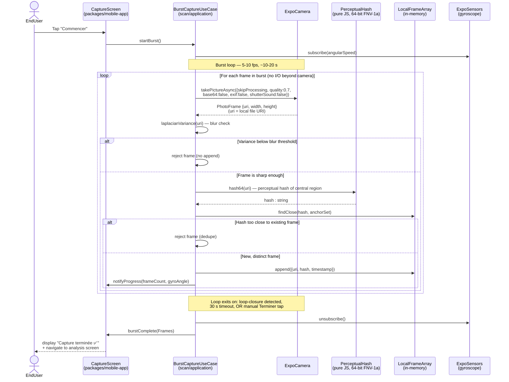

# Sequence diagram — scan / burst capture — frame-by-frame loop

> **Feature**: epic [#751](https://github.com/benoit-bremaud/brasse-bouillon/issues/751) — Smart bottle photo capture. Sub-issue [#946](https://github.com/benoit-bremaud/brasse-bouillon/issues/946) — Burst capture loop + frame deduplication + gyro progress gauge.
> **Source specs**: [`scan-algorithms.md`](../../specs/scan-algorithms.md) §3 phase 2 (Burst capture), phase 3 (Loop-closure detection).
> **Related ADRs**: [ADR-0002](../../decisions/0002-centralized-nestjs-backend.md) (mobile talks only to BB backends).
> **Related work**: PR [#996](https://github.com/benoit-bremaud/brasse-bouillon/pull/996) — tech-spike benchmark harness whose per-frame loop introduced a bug that this diagram makes structurally visible.

## Context

Time-ordered view of what happens **inside the per-frame loop** during a burst capture (5–10 fps for 10–20 seconds on user rotation). All of it runs on-device in pure JavaScript over `expo-camera` (Expo Managed pure — no native frame processor available per spec §6).

This diagram exists primarily to **make per-iteration cost visible**. The burst loop is the hottest path of the feature: anything inside it multiplies by 50–200 frames. The PR #996 tech-spike had a `fetch(photo.uri) → blob()` inside the FPS measurement loop, which inflated the apparent per-frame time and led to a wrong go / no-go signal for #946. A frame-level sequence diagram drawn *before* the spike would have made the extra I/O step obvious.

This diagram does **not** show:

- Pre-capture guidance (silhouette, distance, blur hints) — handled in [05 state diagram](05-state-capture-session.md) as the `PreCapture` state.
- Loop-closure detection across the anchor set (the **decision** to end the burst, vs the per-frame work shown here) — see also §3 phase 3 of the spec.
- The post-burst upload + stitching pipeline — see [02b sequence — end-to-end pipeline](02b-sequence-end-to-end-pipeline.md).

## Diagram

## Notes

### Bugs this diagram catches structurally

- **No I/O inside the loop.** Each iteration only calls `takePictureAsync` (which returns a `uri` to a local file), `laplacianVariance` (pure JS), `hash64` (pure JS), and array operations on `LocalFrameArray` (in-memory). **A `fetch(photo.uri) → blob()` per frame is visibly absent** — the diagram does not draw any participant for a network or filesystem fetch inside the loop. If the implementation introduces one (as PR #996 did), it deviates from this diagram and the FPS numbers it produces are not comparable to the spec's acceptance gate.
- **`takePictureAsync` returns a URI, not bytes.** The camera writes the JPEG to disk and hands back the path. There is no need to re-read the file inside the loop. Any subsequent per-frame work (hash, blur check) reads the file lazily or, in optimised implementations, runs on the in-memory tensor that `expo-camera` already has.
- **Gyro subscription lives outside the loop.** Subscribing to `ExpoSensors` is one-time at burst start. Subscribing inside the loop (one listener per frame) would be a leak and a perf cliff — the diagram excludes it from the loop scope to make the lifecycle explicit.

### Per-iteration cost budget

At 10 fps target, each iteration has **100 ms** total budget. Allocations per spec §3 phase 2:

| Step | Budget | Notes |
|---|---|---|
| `takePictureAsync` with `skipProcessing: true` | ~50–60 ms | Dominant cost. Skip-processing is what makes 10 fps feasible in Expo Managed. |
| Laplacian variance (blur) | ~5–10 ms | Computed on a 64 × 64 central crop, not the full JPEG. |
| Perceptual hash | ~5–10 ms | 64-bit FNV-1a over a strided central region. **Not** over the full JPEG byte stream (which is what PR #996 measured at ~2400 ms — 24× the budget). |
| Dedupe vs anchor set | ~1 ms | Hash comparison is O(anchor_size), anchor set ≤ 3. |
| Append + progress notify | < 1 ms | |
| Slack for GC, JS overhead | ~20 ms | |

If any single step exceeds its budget on real hardware (tech-spike #944 outcome), revisit the spec — either lower the fps target (5 fps is still 360° in ~6 s) or eject from Expo Managed (with the cost that implies).

### Anti-patterns this diagram makes visible

- **Network I/O inside the loop** — `fetch`, `Image.prefetch`, any URL handler. The loop sees only local URIs.
- **Per-iteration subscriptions** — adding then removing a listener inside the loop is a leak / GC pressure source. Subscribe once, unsubscribe at loop end.
- **Hashing the whole JPEG** (vs a strided central crop) — the difference between ~10 ms and ~2400 ms per frame on the spike's Android device. The diagram says "perceptual hash of central region" deliberately; full-bytes hashing is the bug PR #996's Codex P1 comment flags.
- **Capturing PII inside the loop** — there is no participant for telemetry / analytics. If the implementation adds one (logging `Constants.deviceName`, etc.) it must appear here for review before landing. See [06 data flow](06-data-flow.md) for the PII inventory.

### Open questions

- The Laplacian variance threshold is hard-coded to a spike value. Should it be tunable per device class (low-end Android vs high-end iOS)? Track under #946.
- The perceptual-hash variant (FNV-1a strided central) is a first-cut choice. The spec §3 phase 3 mentions a "lightweight ORB-like feature signature" for loop closure — should it replace the hash entirely, or supplement it? Resolve before #947 (loop closure).
