# State diagram — scan / capture session — lifecycle

> **Feature**: epic [#751](https://github.com/benoit-bremaud/brasse-bouillon/issues/751) — Smart bottle photo capture.
> **Source specs**: [`scan-algorithms.md`](../../specs/scan-algorithms.md) §3 phase 1 (Pre-capture), phase 2 (Burst), phase 2.5 (Offline queue), phase 3 (Loop closure), phase 4.5 (Streaming progression).
> **Related ADRs**: none specific.

## Context

State machine of a single **panoramic capture session** — from the moment the user opens the capture screen to the moment a `BeerDataSuggestion` is ready for maintainer review. Captures every transition that the spec mentions as a happy path, fallback, or escape hatch.

Why this diagram matters: the spec defines **eleven transitions** between **eight states** (D2, D4, D5, D6, D7 in `scan-algorithms.md` each rest on one of these transitions). Without a single picture, it is too easy for an implementation to handle only the happy path and crash on, e.g., a network failure during upload — the diagram surfaces every edge that the code must implement.

This diagram does **not** show:

- Internal mechanics inside a state (per-frame loop is in [02a](02a-sequence-burst-capture-frame.md), end-to-end pipeline in [02b](02b-sequence-end-to-end-pipeline.md)).
- Persistence of the session (only `OfflineQueued` writes to disk — see [04 class](04-class.md) for the `OfflineCapture` entity).
- Component dependencies — see [03 component](03-component.md).
- PII flow — see [06 data flow](06-data-flow.md).

## Diagram

```mermaid
stateDiagram-v2
    [*] --> PreCapture : open scan flow

    PreCapture --> Capturing : tap "Commencer" (D2 — always enabled)
    PreCapture --> [*] : tap back

    Capturing --> LoopClosed : loop closure detected (≥ 12 frames + match score crosses threshold)
    Capturing --> Capturing : new frame accepted (gyro angle progresses)
    Capturing --> CaptureFailed : 30 s timeout reached
    Capturing --> CaptureFailed : tap "Terminer" before 12 frames captured
    Capturing --> LoopClosed : tap "Terminer" with ≥ 12 frames

    LoopClosed --> Uploading : auto-transition (D5 — no on-device preview)
    CaptureFailed --> PreCapture : retry path
    CaptureFailed --> [*] : abandon

    Uploading --> Analyzing : 201 received from POST /panoramic-captures
    Uploading --> OfflineQueued : network unavailable (D7)

    OfflineQueued --> Uploading : network reachable + retry (attempts ≤ 5)
    OfflineQueued --> [*] : 7-day TTL expired OR attempts > 5

    Analyzing --> SuggestionReady : SSE event suggestion.created
    Analyzing --> FireAndForget : tap "Continuer ailleurs" (D6, ≥ 10 s on screen)
    Analyzing --> UploadFailed : SSE error event OR stitcher failure

    FireAndForget --> [*] : user leaves the screen; backend continues in background

    SuggestionReady --> [*] : user navigates to result screen
    UploadFailed --> PreCapture : retry path
    UploadFailed --> [*] : abandon

    %% Styling
    classDef happy fill:#9CC,stroke:#333,color:#000
    classDef fallback fill:#FCB,stroke:#333,color:#000
    classDef terminal fill:#C9F,stroke:#333,color:#000
    class PreCapture,Capturing,LoopClosed,Uploading,Analyzing,SuggestionReady happy
    class OfflineQueued,CaptureFailed,UploadFailed,FireAndForget fallback
```

## Notes

### State catalogue

| State | Meaning | Spec reference |
|---|---|---|
| `PreCapture` | Camera open, distance + blur indicators live, "Commencer" CTA visible. | §3 phase 1 |
| `Capturing` | Burst loop running (5–10 fps), frame array accumulating, gyro progress gauge advancing. | §3 phase 2 |
| `LoopClosed` | Burst loop exited cleanly — loop closure detected or user tapped "Terminer" with ≥ 12 frames. Transient state before upload. | §3 phase 3 |
| `CaptureFailed` | Burst exited without enough frames (timeout reached or user terminated early). The user is asked to retry. | §3 phase 2 fallbacks |
| `Uploading` | POST /panoramic-captures in flight. Frames stay in mobile memory until 201 returns. | §3 phase 5 |
| `OfflineQueued` | Network unavailable at upload time. JPEGs persisted to expo-file-system; manifest written to AsyncStorage. Capped at 5 retry attempts + 7 days TTL. | §3 phase 2.5 (D7) |
| `Analyzing` | SSE stream open, backend pipeline running (stitching → OCR → Claude → web verification). | §3 phase 4.5 |
| `FireAndForget` | User left the analysis screen after ≥ 10 s. Backend keeps running, SSE dropped client-side. | §3 phase 4.5 lever C (D6) |
| `SuggestionReady` | `suggestion.created` SSE event received. Result screen ready to display. | §3 phase 8 |
| `UploadFailed` | Either the upload itself failed, or the SSE stream emitted an `error` event from a backend phase. | §3 phase 5 quality gate (D5) |

### Decisions encoded as transitions

- **D2 (2026-05-08)** — "Commencer" is *always enabled*. The transition `PreCapture → Capturing` has no precondition on distance / blur (the underlying frame-quality filter runs at burst time, not at the CTA). The diagram does **not** show a guarded transition because there is no guard.
- **D5 (2026-05-08)** — *No on-device preview between burst and upload*. The transition is `LoopClosed → Uploading` directly, with no intermediate `PreviewStitched` state. If a future implementation adds a preview, it must add a state explicitly and a new ADR.
- **D6 (2026-05-08)** — *"Continuer ailleurs" is mandatory*. The transition `Analyzing → FireAndForget` is part of the canonical machine, not an optional UX nice-to-have.
- **D7 (2026-05-08)** — *Offline queue is mandatory*. The transition `Uploading → OfflineQueued` is one of two possible outcomes of starting an upload — not a degraded fallback.

### Anti-patterns this diagram makes visible

- **Direct transition `PreCapture → Uploading`.** There is no such edge. A user must go through `Capturing → LoopClosed` first. Implementations that try to "skip" the burst (e.g. with a single photo for testing) violate the diagram.
- **`OfflineQueued → SuggestionReady` directly.** There is no such edge either. Offline captures must come back through `Uploading → Analyzing → SuggestionReady` after the retry path succeeds. The diagram refuses any short-circuit.
- **`FireAndForget` is a terminal state (for the session)**, not a return-to-capturing state. The session ends client-side; the user is informed via the polling-based notification ([#939](https://github.com/benoit-bremaud/brasse-bouillon/issues/939)) when the result lands, which spawns a **new** session at `[*] → SuggestionReady` (or simply navigates to the result screen) rather than re-entering `Analyzing`.

### Open questions

- The `CaptureFailed` state today has two retry paths but no metric. Should the number of retries (capture failures per user per day) be tracked under #942 cost monitoring? Track follow-up.
- The `OfflineQueued → [*]` (TTL eviction) silently drops the user's frames. Is a notification owed to the user in that case ("your panoramic capture expired without uploading")? Surface as #946 sub-question.
- `LoopClosed` is transient (no UI). Should it be merged into `Uploading`? Kept distinct because it lets the diagram name the "loop closure detected" event explicitly, which is an event of interest for #947 (loop-closure detection).
