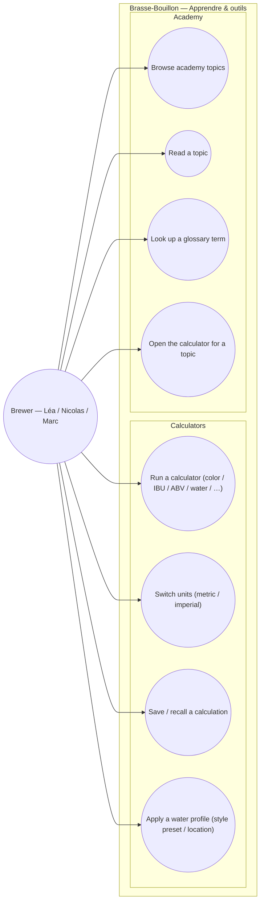

# Use-case diagram — tools & academy — calculators & learning

> **Feature**: brewing calculators (E03, shipped) + academy/glossary (E06,
> shipped); enrichments #657 (save/history), #783/#914 (glossary tooltips→API),
> #660 (unit i18n), #892 (BJCP styles).
> **Refonte**: ux-refonte merges these into one "Apprendre & outils" hub.
> **Personas**: Léa (learn the why), Nicolas/Marc (compute precisely).

## Context

Tools (8 calculators) and Academy (educational topics + glossary) are one feature
module — learning and computing belong together. Who uses them and for what.
Calculators are stateless compute; academy is read + glossary lookup. Grouped by
domain.

## Diagram

## Notes / suggestions

- **Shipped**: UC1 (8 calculators), UC4 (water profiles), UC5/UC6 (topics, some
  "coming-soon"). **Open enrichments**: UC2 unit i18n (#660), UC3 save/history
  (#657), UC7 glossary tooltips backed by an API (#783/#914), UC8 topic→calculator
  link.
- **The 8 calculators**: Couleur (EBC), Houblons (IBU), Fermentescibles, Levures,
  Eau (water salts), Rendement (efficiency), Carbonatation (CO₂), Avancés.
- **Suggestion (gap)**: calculators are isolated today — **feed a recipe** from a
  calculation (e.g. "use this IBU result in my recipe") would close the loop with
  the recipes domain; currently absent. Also **save/recall (UC3)** needs a home —
  the profile or a per-recipe scratch pad.
- **Glossary (UC7)**: #914 moves the glossary to the API so terms are shared with
  recipe/brewing tips (cross-link to brewing-session pedagogical tips).
