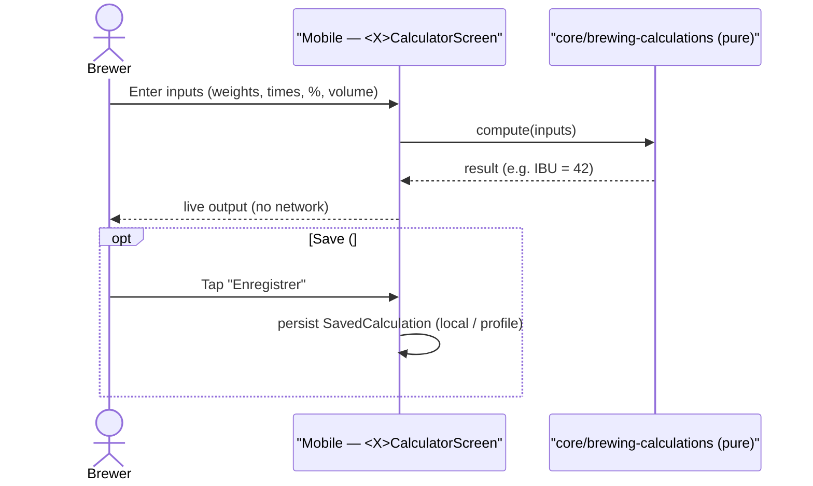
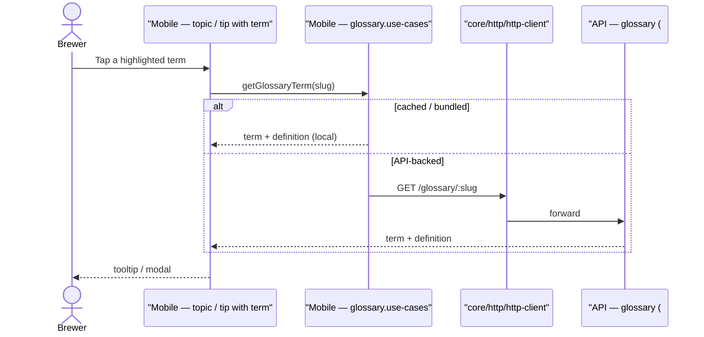

# Sequence diagram — tools & academy — run a calculator & glossary lookup

> **Feature**: calculators E03; glossary tooltip #783/#914.

## Context

The two interactions: running a calculator (live, local, stateless) and looking
up a glossary term from a topic/tip. Calculators need no network; the glossary
becomes API-backed (#914) shared across the app.

## Run a calculator

## Glossary lookup

## Notes / suggestions

- **Calculators stay client-side** (pure functions) — fast, offline, testable in
  isolation (existing tests). No state diagram applies (stateless).
- **Glossary**: ship bundled for v0 (offline), move to API (#914) when it must be
  shared/edited centrally — **one glossary** feeding tools + brewing tips + recipe
  tooltips (suggestion).
- **Save (#657)** is optional persistence; until built, calculators are
  ephemeral — that's fine (KISS).
