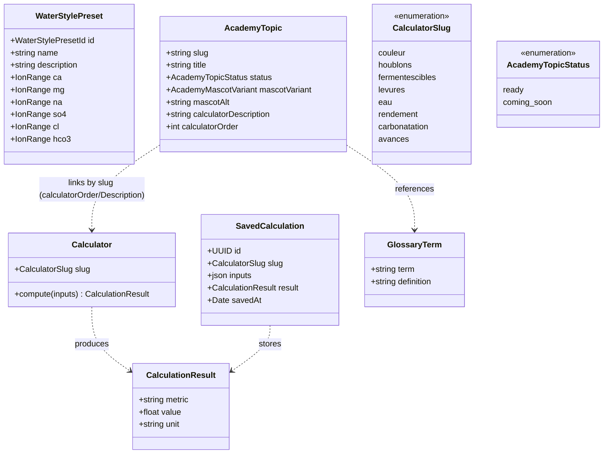

# Class diagram — tools & academy — calculators, topics, glossary

> **Feature**: calculators E03; academy E06; save/history #657; glossary #914.
> **Source**: `features/tools/domain/academy.types.ts`, `water-profiles.ts`,
> `@/core/brewing-calculations`.

## Context

The model behind calculators and academy. Calculators are pure functions over
typed inputs (no persistence unless a calculation is saved — #657). Academy topics
and glossary terms are content. Reflects existing types; `SavedCalculation` and
the API-backed `GlossaryTerm` are flagged additions.

## Diagram

## Notes / suggestions

- **Calculators are pure** (`@/core/brewing-calculations`): inputs → result, no
  state. `SavedCalculation` (#657) is the only persistence, and only if save is
  built — KISS/YAGNI until then.
- **`AcademyTopic`** has no direct `calculator` field; it carries
  `calculatorDescription` + `calculatorOrder` and links to a calculator **by slug
  convention** (the learn→compute bridge). `AcademyTopicStatus` literals are
  `"ready"` / `"coming-soon"` (rendered `coming_soon` in the enum — Mermaid avoids
  the hyphen).
- **`GlossaryTerm`** is content; **suggestion** — back it by the API (#914) and
  reuse it for the brewing-session pedagogical tips + recipe term tooltips, so
  there is **one glossary** across the app rather than three.
- **Unit i18n (#660)**: a `UnitSystem` (see account `Profile`) should drive
  calculator display units — cross-link so units are a single preference.
