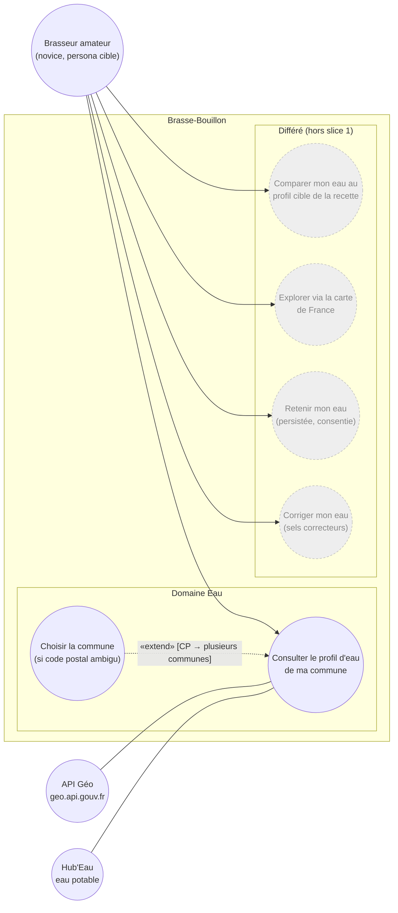

# Use-case diagram — water-profile — local tap-water lookup (slice 1)

> **Feature**: water-profile epic — local tap water by geolocation ([[project_water_profile_epic]])
> **Related ADRs**: ADR-0025 (postal-code geolocation, live proxy first, cache second)
> **Decisions captured**: slice-1 = postal-code → INSEE → live `/water`; map + salts + reuse deferred

## Context

`uc — Domaine Eau : consultation du profil d'eau local (slice 1)`. Actor goals of the **water
domain** for slice 1: the brewer consults the tap-water profile of their commune and compares it
with the recipe's target. External state APIs (`geo.api.gouv.fr`, Hub'Eau) are **supporting
actors** (undirected associations), not use cases. The freshness sync and the drill-down map are
**not** use cases here: the sync is a system-internal mechanism (shown in the sequence diagrams),
the map is a deferred UX epic. Deferred actor goals are shown greyed to make scope explicit.

## Diagram

## Notes

- **UML orthodoxy**: use cases are actor-initiated goals (verb phrases). `UC1` and `UC3` are
  goals the brewer initiates; the **freshness cache sync** (slice 2) is a system mechanism, not a
  use case — realized in `03-sequence-slice2-cache-sync`, triggered by `UC1`, never an actor goal.
- **Supporting actors**: `geo.api.gouv.fr` and Hub'Eau are external systems `UC1` relies on,
  drawn with **undirected** associations (`---`) on the right. The call direction (who invokes
  whom) belongs to `04-component`, not here.
- **`UC2` is an «extend»** with a real guard `[CP → plusieurs communes]`: disambiguation only
  fires when one postal code maps to several communes (verified live: `01400` → 10). Arrondissement
  input resolves to the parent commune.
- **`UC3` (compare my water to the recipe target) is deferred with the compatibility score**
  (ADR-0025 § Compatibility): the existing global 0–100 score coerces missing/nullable ions to 0,
  so it is unsafe for the live 5-ion profile (no Na); slice-1 renders the **raw** profile only.
- The **deferred** goals (compare-to-target, map, remember-my-water, corrective salts) are solid
  associations greyed via `classDef` so the slice-1 boundary is unambiguous; each is its own later
  slice/epic per ADR-0025.
