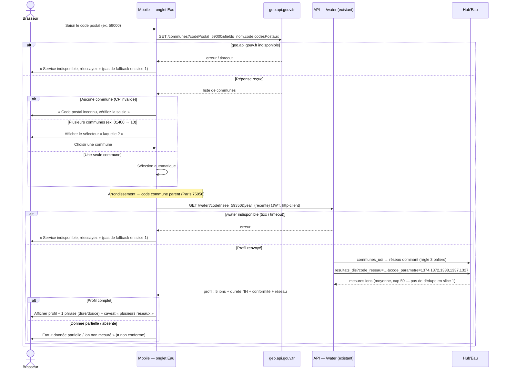

# Sequence diagram — water-profile — slice 1: postal code → INSEE → live profile

> **Feature**: water-profile epic — slice 1 ([[project_water_profile_epic]])
> **Related ADRs**: ADR-0025 (§ Geo input model, § Where INSEE resolution lives)
> **Decisions captured**: live `geo.api.gouv.fr` resolve, forced disambiguation, existing `/water`

## Context

`sd — UC1 Consulter le profil d'eau de ma commune (slice 1, live proxy)`. Realizes the
postal-code → disambiguation → INSEE → `GET /water` flow on the **existing** backend proxy.
Covers the many-to-many branch (one postal code → several communes), the empty-input branch
(invalid postal code), the **no-fallback** external-error branch (slice 1 has no cache), and the
partial-data branch. The mobile calls go through the shared `http-client` (never a direct
`fetch`).

## Diagram

## Notes

- **Disambiguation is mandatory** (many-to-many, verified live): the app must never assume one
  postal code → one INSEE. The picker resolves to a **single 5-digit INSEE** before `/water`.
- **No fallback in slice 1**: both external calls (geo + `/water`) surface an error to the user on
  failure — slice 1 has no cache. The DB fallback arrives with slice 2
  (`03-sequence-slice2-cache-sync`).
- The `/water` internals (dominant-network selection + ion fetch by SANDRE code, **plain average**
  over ≤ 50 rows, **no** `code_prelevement` dedupe) are the **existing** backend (`6595786`);
  slice 1 adds **no** backend change — the mobile is a pure consumer via a new use-case +
  `http-client`.
- **SANDRE ion codes** (existing #1352 mapping): Ca `1374`, Mg `1372`, SO4 `1338`, Cl `1337`,
  HCO3 `1327`. **Na (`1367`) is absent by design** → shown "non mesuré", never null/0-fed into any
  score.
- **Freshness** here is year-granular (the DTO has no `date_prelevement` yet); the dated pastille
  arrives with slice 2.
- The partial/empty branch is a **first-class state** — blanks must not read as "non conforme".
