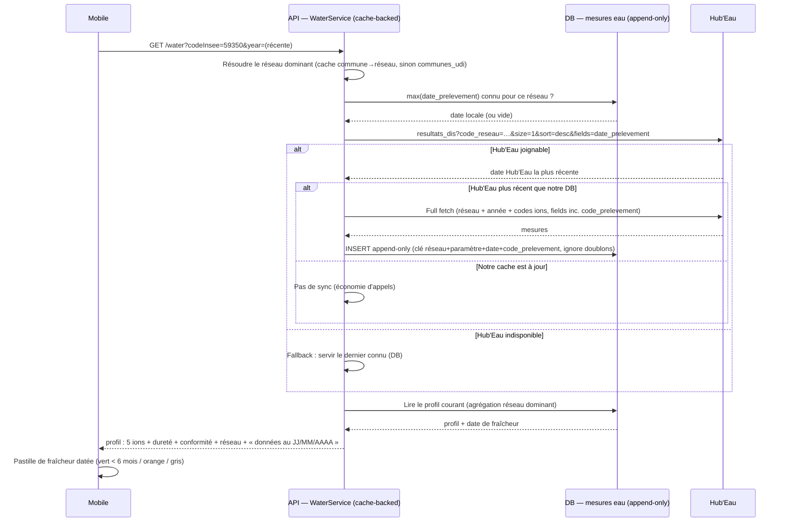

# Sequence diagram — water-profile — slice 2: append-only cache + conditional sync

> **Feature**: water-profile epic — slice 2 ([[project_water_profile_epic]])
> **Related ADRs**: ADR-0025 (§ Data locality, § Slice-2 design), ADR-0004, ADR-0015
> **Decisions captured**: cheap date-check → conditional full sync → append-only → DB fallback

## Context

`sd — Rafraîchir & servir le profil d'eau depuis notre cache (slice 2)`. Slice 2 makes `/water`
**cache-backed**: it serves from our DB, refreshes only when Hub'Eau is genuinely newer (a cheap
date-check gate), appends measurements (never overwrites → history), and falls back to the last
known data when Hub'Eau is unreachable. It keeps the **existing `code_reseau` keying** (dominant
network) so the aggregation is identical to slice 1 — **not** a `code_commune` fetch, which would
blend all networks and shift the average. This finally exposes the **dated freshness** the DTO
lacks today.

## Diagram

## Notes

- **Same key as slice 1**: slice 2 keeps `code_reseau` (the dominant network), so the aggregation
  semantics are unchanged; it only **adds** `code_prelevement` to the fetched `fields` (the live
  path does not request it) to key the append-only rows.
- **Two-step sync is deliberate**: the size=1 date-check is cheap and gates the expensive full
  fetch — most lookups do **no** heavy call. Reduces Hub'Eau load and our latency.
- **Append-only** (unique key `réseau + paramètre + date_prelevement + code_prelevement`) means
  the full fetch is **idempotent** (`INSERT … ON CONFLICT DO NOTHING`) and history accrues for
  free — the basis for later evolution analytics (deferred, ADR-0025).
- **DTO evolution is additive**: slice 2 adds the freshness date to the DTO; the endpoint
  contract and the 5 ions/hardness/conformity/network are unchanged, and the mobile only upgrades
  its year-granular line to a dated pastille.
- **Fallback** on Hub'Eau outage serves stale-but-honest data with its date — resilience the
  live-proxy slice-1 lacks.
- **RGPD**: this cache is **public** ARS/Hub'Eau data, not PII. The user's location is not stored
  here (that is the deferred, consented "remember my water" slice — ADR-0003).
- **Freshness pastille**: `max(date_prelevement)` is the honest currency (Hub'Eau lags ~6 weeks);
  never present the fetch date as the data date.
