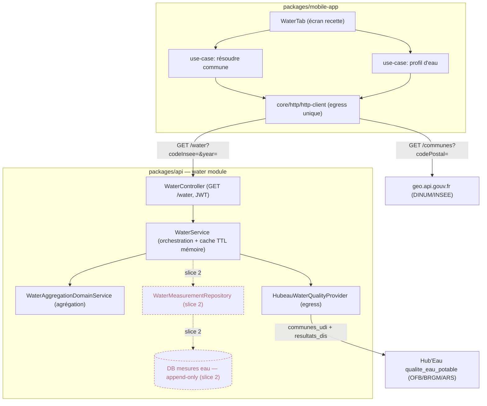

# Component diagram — water-profile — mobile ↔ API ↔ sovereign external APIs

> **Feature**: water-profile epic — slices 1 & 2 ([[project_water_profile_epic]])
> **Related ADRs**: ADR-0025, ADR-0002 (centralized backend), ADR-0004 (data locality)
> **Decisions captured**: egress via `http-client` (mobile) + `HubeauProvider` (API); cache = slice 2

## Context

Structural view. Answers "where does each responsibility live and what are the egress points",
not "who wants what" (that is `01-use-case`). Makes the **two external egresses** explicit —
the mobile `http-client` (no direct `fetch`) and the backend `HubeauWaterQualityProvider` — and
marks which components are **slice 2** (the durable cache).

## Diagram

## Notes

- **Two egress points, both explicit**: mobile leaves only through `http-client` (the project
  forbids a direct `fetch` elsewhere); the backend leaves only through
  `HubeauWaterQualityProvider`. The geo resolution is a mobile-side call to the sovereign state
  API **through `http-client`** — not a new backend endpoint (ADR-0025 § INSEE resolution = A).
- **Aggregation** lives in `WaterAggregationDomainService` (a domain service `WaterService`
  orchestrates), not in `WaterService` itself.
- **Caching**: `WaterService` already holds a **process-level in-memory TTL cache** (a `Map` on
  the singleton, shared across requests) on the live path (slice 1). `WaterMeasurementRepository`
  + the append-only DB are the **slice-2** *durable / history* layer — a different, additional
  cache, not the first one.
- **Slice boundary**: the **endpoint contract and the mobile call site are unchanged** when slice
  2 lands; slice 2 **additively** extends the `/water` DTO with the freshness date (the mobile
  upgrades its year-granular line to a dated pastille). Same `GET /water`, same 5
  ions/hardness/conformity/network.
- This is **not** the use-case grouping: `geo.api.gouv.fr` and Hub'Eau appear here as
  infrastructure dependencies, consistent with `01-use-case` where they are supporting actors.
- No US vendor anywhere — the whole egress is FR/EU-sovereign (ADR-0025 § study).
