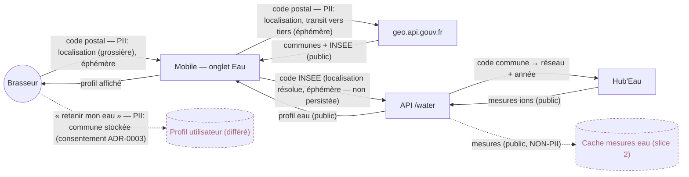

# Data-flow diagram — water-profile — what flows where, and what is PII

> **Feature**: water-profile epic — slices 1 & 2 ([[project_water_profile_epic]])
> **Related ADRs**: ADR-0025, ADR-0003 (consent single source of truth), ADR-0004
> **Decisions captured**: location = coarse PII kept ephemeral in slice 1; water data = public

## Context

Traces the data and flags the **privacy boundary** that drives ADR-0025: the user's
**location** (postal code / chosen commune) is coarse PII, whereas the **water measurements**
are public ARS/Hub'Eau reference data. Slice 1 keeps the location **ephemeral** (never
persisted → no consent surface); the slice-2 cache stores **only public water data**. Persisting
the location is a **deferred, consented** flow (dashed), not part of these slices.

## Diagram

## Notes

- **The privacy line**: only the **location** edges carry PII. The postal code / commune is
  coarse location; in slice 1 it is **transient** (used to resolve INSEE, then dropped) — no
  storage, **no consent surface opened**.
- **Public data ≠ PII**: the slice-2 cache holds commune water measurements (ARS/Hub'Eau public
  data). Storing it triggers **no** RGPD obligation — this is what makes the cache safe to build.
- **Deferred consented flow** (dashed `UserStore`): "remember my water" would persist the chosen
  commune (stored PII) → falls under **ADR-0003** consent + a retention decision. Explicitly out
  of ADR-0025's slices.
- **Minimisation**: we send Hub'Eau only a commune code + year; we send geo.api.gouv.fr only a
  postal code. No name, no address, no precise geolocation (lat/lon) is ever collected.
