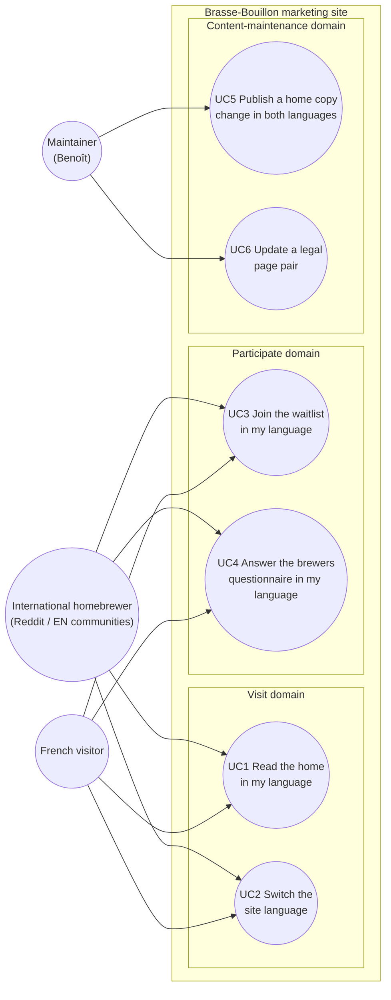

# Use case diagram — website-i18n — bilingual FR+EN marketing site

> **Feature**: website i18n epic (bilingual FR+EN marketing site, Reddit-readiness)
> **Related ADRs**: ADR-0027, ADR-0014
> **Decisions captured**: ADR-0027 D1 (hybrid content strategy), D3 (shared forms), D4 (switcher)

## Context

`uc — Website i18n`. Who wants what from a bilingual marketing site — visitors
(reading, switching language, participating) and the maintainer (publishing
without drift). This diagram does NOT cover how pages are generated (see
`03-data-flow-content-pipeline.md`) nor SEO/crawler mechanics (not actor goals).

## Diagram

## Notes

- **Textual specs (Cockburn-lite).**
  - **UC2 — Switch the site language** (planned, slice S3): precondition —
    visitor is on a page that has a twin. Main: 1. visitor clicks the FR/EN
    toggle; 2. browser navigates to the twin URL; 3. choice stored (`bb-lang`).
    Extensions: 1a. first visit, browser language differs from page language and
    no stored choice → a suggestion banner offers the twin (accept = navigate +
    store; dismiss = store current language, never nag again). Realized by
    `02-sequence-language-switch.md`.
  - **UC5 — Publish a home copy change in both languages** (planned, slice S1):
    main: 1. maintainer edits `index.html` (FR source); 2. updates the flagged
    keys in `i18n/home.en.json`; 3. runs `build_i18n.py`; 4. commits — CI fails
    on any missing/orphaned key or stale `en.html`. Realized by
    `03-data-flow-content-pipeline.md`.
  - **UC6 — Update a legal page pair** (planned, slice S4): main: edit FR page,
    re-review + edit EN twin, refresh the freshness stamp; CI fails when the FR
    page changed and the stamp did not.
  - UC1/UC3/UC4 are plain reads/submits — textual spec only, no sequence
    (proportionality rule); UC3/UC4 post to the shared Formspree endpoints with
    `lang` set per page (ADR-0027 D3).
- Search-engine crawling/indexing is deliberately absent: "be indexed" is not an
  actor-initiated goal (UML 2.5 orthodoxy); the SEO switch is captured as
  ADR-0027 D5, not as a use case.
- Both visitor actors share UC1–UC4 on purpose — the feature's whole point is
  goal parity across languages; no actor generalization is needed.
- Component, class and state diagrams are deliberately skipped
  (proportionality rule): the site is a flat static package with no new runtime
  component (the authoring/CI/deploy structure lives in
  `03-data-flow-content-pipeline.md`), no new domain types, and no stateful
  entity beyond the one-shot banner already covered by the sequence diagram.
