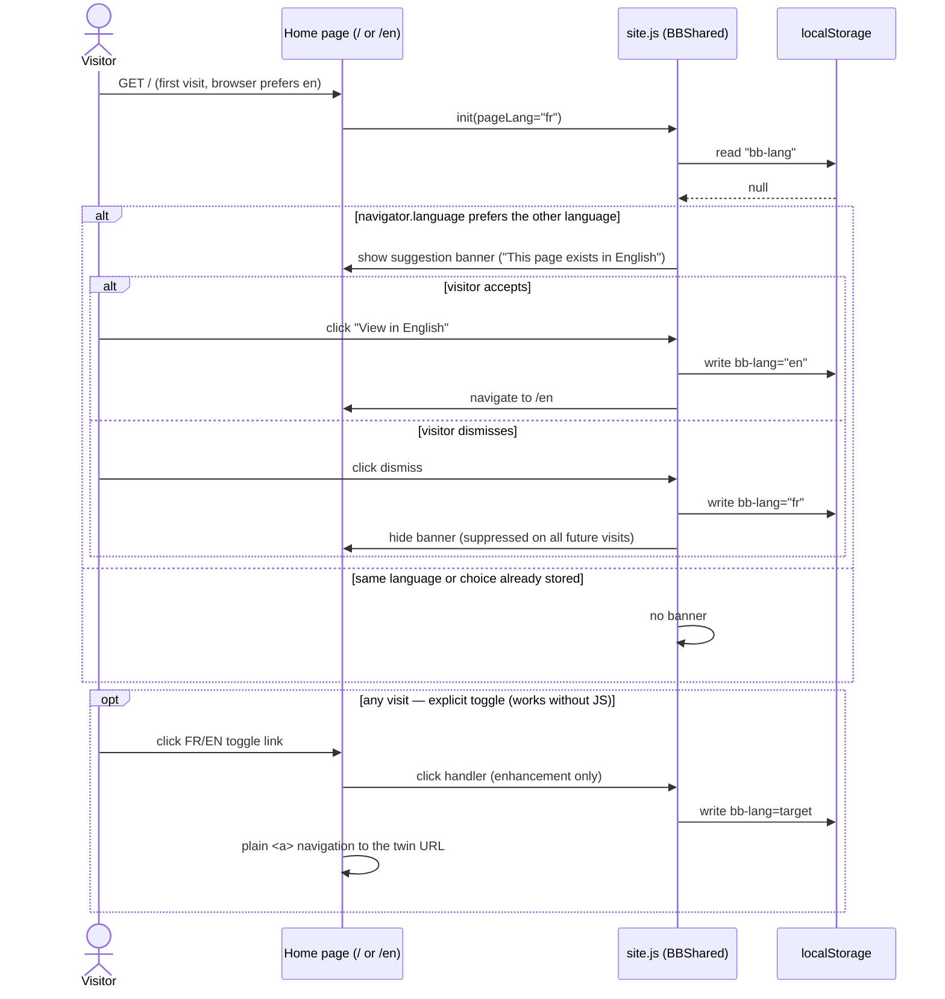

# Sequence diagram — website-i18n — language detection, suggestion banner and switch

> **Feature**: website i18n epic (bilingual FR+EN marketing site)
> **Related ADRs**: ADR-0027 (D4 — switcher, no auto-redirect, disclosed persistence)
> **Decisions captured**: D4 clauses 1–4

## Context

`sd — UC2 Switch the site language`. The only non-trivial client flow of the
epic: first-visit language suggestion, explicit switch, and remembered choice.
It does NOT cover page generation (build-time, see `03-data-flow`) and applies
to the two home pages only — legal pages keep their existing plain
`.lang-switch` links.

## Diagram

## Notes

- **No automatic redirect on any path** — detection only ever *suggests*
  (ADR-0027 D4 clause 3): crawler-safe, cache-safe, user-agency-safe.
- The toggle is a plain `<a href>` in the **top-right of the header**, labelled
  by **autonym** (`Français` / `English`, or a compact `FR / EN`) — **no flags**
  (ADR-0027 D4 clauses 1-2; "flags are not languages", NN/G). It targets the
  translated equivalent of the current page. JS only adds persistence — the whole
  flow degrades gracefully with JS disabled (banner simply never appears).
- Detection reads `navigator.languages` (ordered BCP 47 list, matched by lookup
  with `en-US` → `en` fallback), a *hint* only — it drives the banner, never an
  automatic switch (ADR-0027 D4 clause 4; Google discourages language
  auto-redirect).
- `bb-lang` is the **first persistent storage on the site**: the same slice
  (S3) must update `cookies.html` + `cookies-en.html` disclosure (D4 clause 4).
  Reviewers should block any version of this flow that lands without the
  disclosure.
- A stored choice never triggers navigation by itself; it only suppresses the
  banner and sets the toggle's highlighted state.
