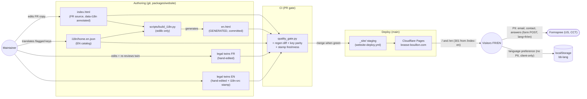

# Data-flow diagram — website-i18n — bilingual content pipeline (authoring → deploy)

> **Feature**: website i18n epic (bilingual FR+EN marketing site)
> **Related ADRs**: ADR-0027 (D1 — hybrid strategy; D2 — URL scheme), ADR-0014
> **Decisions captured**: D1 clauses 1–5, D2 clause 2

## Context

Where bilingual content comes from and how it reaches production. Contingent on
ADR-0027 acceptance (hybrid: generated EN home, guarded legal twins). Also flags
the only two visitor-side data flows (form submissions, language preference) so
the privacy review cannot be skipped.

## Diagram

## Notes

- The generator runs at **authoring time**, never at deploy time — `en.html` is
  committed, so `website-deploy.yml` stays a dumb copy (`_redirects` added to its
  fail-loud copy list, ADR-0027 D2 clause 2).
- CI is the drift guard: stale `en.html`, missing/orphaned catalog keys, or a
  stale legal stamp all fail the PR (D1 clause 4–5).
- **PII edges**: only the existing Formspree submissions carry PII (email,
  contact field, questionnaire answers) — unchanged by this epic, EN adds
  `lang=en` only. `bb-lang` is a non-PII functional preference that never leaves
  the browser; it must be disclosed on the cookies pages (D4 clause 4).
- Legal twins deliberately bypass the generator: stable, jurisdiction-specific
  prose (guarded by stamp, not templated).
