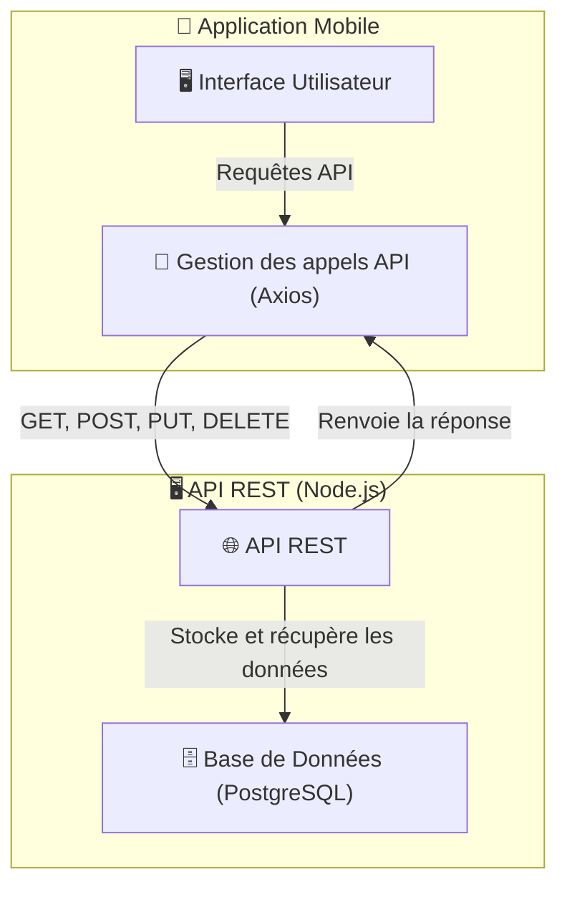

# 🌐 **Gestion des Appels API - Brasse-Bouillon**  

## 📌 **Introduction**  

L’application **Brasse-Bouillon** communique avec une **API REST** pour **gérer les utilisateurs, les recettes et les sessions de brassage**.  
Nous utilisons **Axios** pour simplifier les requêtes HTTP et assurer une **gestion optimisée des erreurs** et des **chargements**.  

📌 **Pourquoi Axios et non Fetch ?**  
✅ **Plus simple à utiliser** (gestion automatique des JSON, interception des requêtes).  
✅ **Gestion centralisée des erreurs et des en-têtes**.  
✅ **Support des requêtes concurrentes et des timeouts**.  

---

## 📊 **Schéma des Appels API**  

📌 **Illustration de la communication entre le frontend et l’API REST.**  



---

## ⚙️ **Configuration Axios**

📌 **Nous utilisons une configuration centralisée d’Axios pour faciliter l’envoi des requêtes.**  

```javascript
import axios from "axios";

const API_BASE_URL = "https://api.brasse-bouillon.com";

const apiClient = axios.create({
  baseURL: API_BASE_URL,
  timeout: 5000, // Timeout après 5s
  headers: {
    "Content-Type": "application/json",
  },
});

// Intercepteur pour ajouter le token d’authentification
apiClient.interceptors.request.use((config) => {
  const token = localStorage.getItem("authToken");
  if (token) {
    config.headers.Authorization = `Bearer ${token}`;
  }
  return config;
});

export default apiClient;
```

---

## 🔄 **Gestion des Requêtes API**

### **1️⃣ Récupération des Recettes**

📌 **Méthode GET pour récupérer toutes les recettes.**  

```javascript
export const fetchRecipes = async () => {
  try {
    const response = await apiClient.get("/recipes");
    return response.data;
  } catch (error) {
    console.error("Erreur lors de la récupération des recettes", error);
    throw error;
  }
};
```

---

### **2️⃣ Ajout d’une Nouvelle Recette**

📌 **Méthode POST pour envoyer une nouvelle recette à l’API.**  

```javascript
export const addRecipe = async (recipeData) => {
  try {
    const response = await apiClient.post("/recipes", recipeData);
    return response.data;
  } catch (error) {
    console.error("Erreur lors de l’ajout de la recette", error);
    throw error;
  }
};
```

---

### **3️⃣ Mise à Jour d’une Recette**

📌 **Méthode PUT pour modifier une recette existante.**  

```javascript
export const updateRecipe = async (recipeId, updatedData) => {
  try {
    const response = await apiClient.put(`/recipes/${recipeId}`, updatedData);
    return response.data;
  } catch (error) {
    console.error("Erreur lors de la mise à jour de la recette", error);
    throw error;
  }
};
```

---

### **4️⃣ Suppression d’une Recette**

📌 **Méthode DELETE pour supprimer une recette par ID.**  

```javascript
export const deleteRecipe = async (recipeId) => {
  try {
    await apiClient.delete(`/recipes/${recipeId}`);
  } catch (error) {
    console.error("Erreur lors de la suppression de la recette", error);
    throw error;
  }
};
```

---

## ⚠️ **Gestion des Erreurs**

📌 **Nous implémentons une gestion robuste des erreurs pour améliorer l’expérience utilisateur.**  
✅ **Gestion des erreurs API globalement via Axios Interceptors.**  
✅ **Affichage de messages utilisateurs en cas d’échec.**  

```javascript
apiClient.interceptors.response.use(
  (response) => response,
  (error) => {
    console.error("Erreur API:", error.response?.data || error.message);
    return Promise.reject(error);
  }
);
```

---

## 🚀 **Bonnes Pratiques**

✅ **Utiliser `useEffect` ou React Query pour gérer les appels API.**  
✅ **Afficher des loaders (`isLoading`) pour indiquer les chargements.**  
✅ **Ne pas stocker les tokens dans `localStorage` pour éviter les failles XSS (préférer `httpOnly cookies`).**  
✅ **Limiter les appels API avec un cache côté client.**  

---

## 📌 **Conclusion**

Avec **Axios et une gestion optimisée des appels API**, nous assurons une **communication efficace entre le frontend et le backend**. 🎯  
💡 **L’optimisation des requêtes API améliore la performance et l’expérience utilisateur.**  
