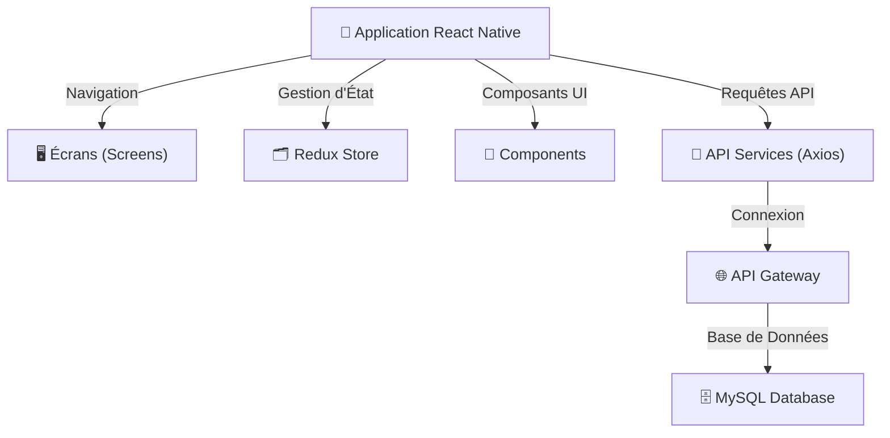

# Architecture Frontend - Brasse-Bouillon

## 1. Introduction

Ce document décrit la structure de l’architecture frontend du projet **Brasse-Bouillon**, les technologies utilisées et l'organisation des fichiers. Il s’appuie sur les documents suivants pour garantir la cohérence avec l’ensemble du projet :

📌 **Documents de référence :**

- **`architecture_overview.md`** : Vue globale des composants du système.
- **`api_interactions.md`** : Décrit les interactions API.
- **`component_diagram.md`** : Décrit les interactions frontend-backend.
- **`data_model.md`** : Définit les entités manipulées côté client.
- **`performance_optimization.md`** : Liste les optimisations frontend.

---

## 2. Structure des Dossiers

L'architecture frontend suit une organisation modulaire pour assurer **maintenabilité, évolutivité et performance**.

📂 **Organisation recommandée du frontend :**
```
/frontend
 ├── src/
 │   ├── components/       # Composants React
 │   ├── screens/          # Écrans de l’application
 │   ├── navigation/       # Gestion de la navigation
 │   ├── store/            # Gestion du state (Redux)
 │   ├── hooks/            # Hooks personnalisés
 │   ├── assets/           # Images, styles
 │   ├── services/         # Appels API avec Axios
 │   ├── utils/            # Fonctions utilitaires
 │   ├── App.js            # Point d’entrée du frontend
 │   ├── index.js          # Initialisation de l’application
```

---

## 3. Technologies Utilisées

| Technologie | Rôle |
|-------------|----------------|
| **React Native** | Framework mobile |
| **Redux** | Gestion d’état |
| **React Navigation** | Gestion de la navigation |
| **Axios** | Requêtes API |
| **Jest / React Testing Library** | Tests |
| **Styled Components** | Gestion des styles |
| **AsyncStorage / MMKV** | Stockage local pour persistance des données |

---

## 4. Explication des Composants Frontend

- **Components :** UI réutilisable et modulaire.
- **Screens :** Pages principales de l’application (Recettes, Sessions, Profil).
- **Navigation :** Gestion des routes et transitions.
- **Store :** Stockage des données globales (Redux, Context API).
- **Services :** Communication avec l’API backend via Axios.
- **Hooks :** Gestion des états et logique réutilisable.
- **Optimisation :** Utilisation de MMKV pour améliorer les performances de stockage local.

---

## 5. Schéma UML de l'Architecture Frontend



---

## 6. Alignement avec l'Architecture Globale

📌 **Références aux autres documents d’architecture :**

| Document | Rôle |
|------------|------------|
| **`api_interactions.md`** | Liste des API et de leurs flux |
| **`component_diagram.md`** | Décrit les interactions entre le frontend et le backend |
| **`data_model.md`** | Définit les entités et données manipulées côté client |
| **`performance_optimization.md`** | Optimisation du rendu et gestion de la mémoire |

---

## **Conclusion**

Ce document fournit une **référence claire pour le développement du frontend**, garantissant **modularité, maintenabilité et performance**.

