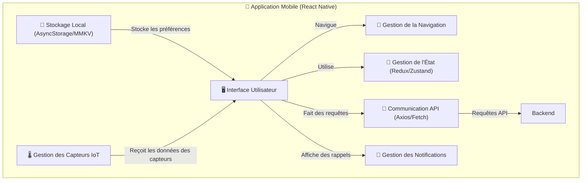

# 📱 Architecture du Frontend - Brasse-Bouillon

## 📌 Introduction

Ce document décrit **l’architecture du frontend** de l’application **Brasse-Bouillon**. L’application mobile est développée en **React Native**, permettant un déploiement multiplateforme sur **iOS et Android**.

L’objectif est de détailler **les composants clés**, leur **organisation**, et **leurs interactions** avec les autres modules du projet.

---

## 📊 **Diagramme de l’Architecture Frontend**

---

## 📖 **Explication du Diagramme**

### **🖥️ Interface Utilisateur (UI)**

📌 Gère **l’affichage des écrans** et **les interactions utilisateur**.

- **Écrans principaux** : Accueil, Recettes, Sessions de Brassage, Profil.
- **Composants réutilisables** : Boutons, Formulaires, Listes interactives.

### **🔄 Gestion de la Navigation**

📌 Assure **le passage entre les écrans** de manière fluide.

- **Utilisation de React Navigation** : Stack Navigation, Tab Navigation.

### **💾 Gestion de l’État (Redux/Zustand)**

📌 Stocke **les données globales** de l’application (recettes, sessions, utilisateur).

- Permet d’**éviter les appels API répétés** et d’améliorer la réactivité.

### **🔌 Communication API (Axios/Fetch)**

📌 Gère **les requêtes HTTP** vers l’API Backend.

- **Exemples de requêtes** : récupération des recettes, connexion utilisateur, création de sessions de brassage.

### **💾 Stockage Local (AsyncStorage/MMKV)**

📌 Permet de stocker **les préférences utilisateur** et certaines données en cache.

- **Exemples** : Données de session enregistrées localement pour un accès hors ligne.

### **📢 Gestion des Notifications**

📌 Gère **les rappels et notifications push** pour informer l’utilisateur.

- Utilisation de **Firebase Cloud Messaging (FCM)** pour les notifications mobiles.

### **🌡️ Gestion des Capteurs IoT**

📌 Communication avec les **capteurs de température et hydromètre**.

- **Mise à jour des données en temps réel** via Bluetooth ou Wi-Fi.

---

## 📌 **Conclusion**

Ce diagramme détaille **l’architecture du frontend** et son interaction avec le backend et les autres composants. Chaque module sera approfondi dans un diagramme spécifique.

📂 **Lieu du fichier** : `docs/architecture/frontend/frontend_architecture.md`
