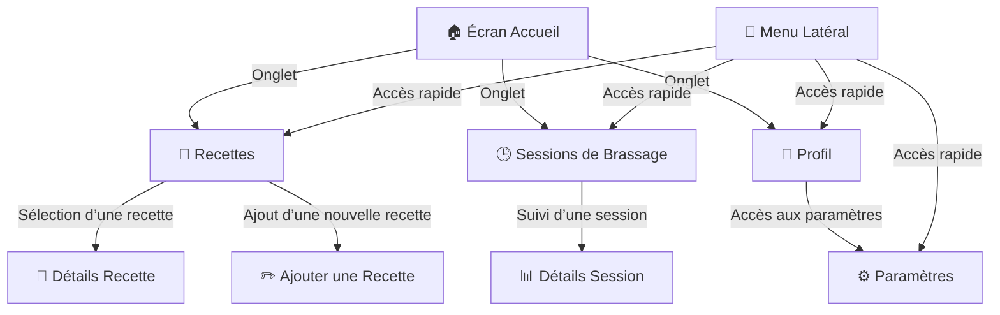

# 📱 Structure de Navigation - Brasse-Bouillon

## 📌 Introduction

La navigation est un élément central de l’expérience utilisateur de l’application **Brasse-Bouillon**. Elle permet aux brasseurs amateurs de naviguer facilement entre les différentes sections de l’application et d’accéder rapidement aux fonctionnalités essentielles.

Cette documentation détaille **l’architecture de la navigation**, les types de navigation utilisés et les meilleures pratiques pour garantir une expérience fluide.

---

## 📊 **Schéma Global de la Navigation**



---

## 📖 **Types de Navigation Utilisés**

### 🔹 **1️⃣ Stack Navigation (Navigation entre écrans)**

📌 Utilisée pour la transition entre les écrans principaux comme **Recettes → Détails Recette**.

Exemple de configuration :

```javascript
import { createNativeStackNavigator } from '@react-navigation/native-stack';

const Stack = createNativeStackNavigator();

function RecipeNavigator() {
  return (
    <Stack.Navigator>
      <Stack.Screen name="Recipes" component={RecipesScreen} />
      <Stack.Screen name="RecipeDetails" component={RecipeDetailsScreen} />
      <Stack.Screen name="NewRecipe" component={NewRecipeScreen} />
    </Stack.Navigator>
  );
}
```

### 🔹 **2️⃣ Bottom Tabs Navigation (Navigation par onglets)**

📌 Permet d’accéder rapidement aux sections principales de l’application (**Accueil, Recettes, Sessions, Profil**).

Exemple de configuration :

```javascript
import { createBottomTabNavigator } from '@react-navigation/bottom-tabs';

const Tab = createBottomTabNavigator();

function MainNavigator() {
  return (
    <Tab.Navigator>
      <Tab.Screen name="Home" component={HomeScreen} />
      <Tab.Screen name="Recipes" component={RecipeNavigator} />
      <Tab.Screen name="Sessions" component={SessionsScreen} />
      <Tab.Screen name="Profile" component={ProfileScreen} />
    </Tab.Navigator>
  );
}
```

### 🔹 **3️⃣ Drawer Navigation (Menu Latéral)**

📌 Utilisé pour un **accès rapide** aux fonctionnalités supplémentaires comme **Paramètres**.

Exemple de configuration :

```javascript
import { createDrawerNavigator } from '@react-navigation/drawer';

const Drawer = createDrawerNavigator();

function DrawerNavigator() {
  return (
    <Drawer.Navigator>
      <Drawer.Screen name="Home" component={MainNavigator} />
      <Drawer.Screen name="Settings" component={SettingsScreen} />
    </Drawer.Navigator>
  );
}
```

---

## 📡 **Gestion des Paramètres de Navigation**

### 🔹 Passage de Paramètres entre Écrans

📌 Exemple : Envoyer une recette sélectionnée vers l’écran des détails.

```javascript
navigation.navigate('RecipeDetails', { recipeId: selectedRecipe.id });
```

📌 Récupération des paramètres :

```javascript
const { recipeId } = route.params;
```

### 🔹 Gestion des Permissions et Accès Sécurisés

📌 Restreindre l’accès à certaines fonctionnalités selon l’utilisateur.

```javascript
if (!user.isAuthenticated) {
  navigation.replace('Login');
}
```

---

## 🚀 **Bonnes Pratiques et Optimisation**

✔ **Éviter les re-renders inutiles** en utilisant `useMemo` et `React.Context` pour le stockage d’état global.  
✔ **Utiliser `useNavigation`** pour une navigation simplifiée au sein des composants.  
✔ **Adopter une structure modulaire** en séparant la logique des routes et des composants d’affichage.  

---

## 📌 **Conclusion**

Cette documentation détaille **l’architecture de la navigation** de l’application **Brasse-Bouillon**. Les sous-modules comme **les composants UI** et **les écrans spécifiques** seront traités séparément.

📂 **Lieu du fichier :** `docs/architecture/frontend/navigation_structure.md`

