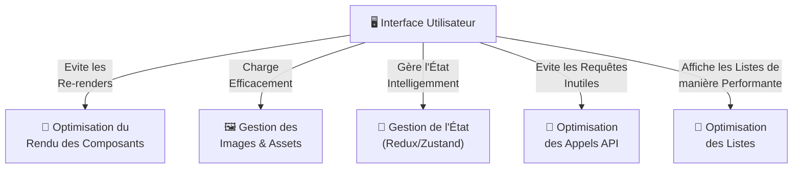

# 🚀 **Optimisation des Performances UI - Brasse-Bouillon**  

## 📌 **Introduction**  

L’optimisation des performances dans une application **React Native** est essentielle pour offrir une **expérience utilisateur fluide** et éviter les **lags et re-renders inutiles**.  

Dans **Brasse-Bouillon**, nous utilisons plusieurs **techniques d’optimisation** pour :  
✅ **Réduire les temps de chargement** des écrans et des données.  
✅ **Améliorer la fluidité des animations et transitions.**  
✅ **Minimiser la consommation de mémoire et éviter les fuites de mémoire.**  

---

## 📊 **Schéma de l’Optimisation des Performances**  

📌 **Illustration des différentes couches d’optimisation.**  



---

## **1️⃣ Optimisation des Listes et Rendu**

📌 **Problème :** Une liste avec de nombreuses **recettes ou sessions de brassage** peut ralentir l’application.  
📌 **Solution :** Utilisation de `FlatList` au lieu de `ScrollView`.  

✅ **Pourquoi utiliser `FlatList` ?**  
✔️ Il **ne charge que les éléments visibles à l’écran**, ce qui améliore les performances.  
✔️ Il gère le **lazy loading** et le **scroll infini**.  

📌 **Exemple d’utilisation avec `FlatList` :**  

```javascript
import { FlatList } from 'react-native';

const RecipeList = ({ recipes }) => {
  return (
    <FlatList
      data={recipes}
      keyExtractor={(item) => item.id.toString()}
      renderItem={({ item }) => <RecipeCard recipe={item} />}
      initialNumToRender={10} // Charge seulement 10 items au début
    />
  );
};
```

📌 **Amélioration : Utilisation de `getItemLayout` pour éviter les calculs inutiles.**  

```javascript
getItemLayout={(data, index) => ({
  length: 100, // Hauteur fixe des items
  offset: 100 * index,
  index
})}
```

---

## **2️⃣ Gestion des Images et Assets**

📌 **Problème :** Les images haute résolution ralentissent le rendu.  
📌 **Solution :** Chargement optimisé avec `react-native-fast-image`.  

📌 **Pourquoi `react-native-fast-image` ?**  
✔️ Chargement **asynchrone** et **mise en cache** automatique.  
✔️ Support du **préchargement** des images pour éviter les blancs à l’affichage.  

📌 **Exemple d’implémentation :**  

```javascript
import FastImage from 'react-native-fast-image';

const RecipeImage = ({ uri }) => (
  <FastImage
    style={{ width: 100, height: 100 }}
    source={{ uri, priority: FastImage.priority.high }}
    resizeMode={FastImage.resizeMode.cover}
  />
);
```

📌 **Autres bonnes pratiques :**  
✅ **Utiliser des formats compressés** (`WebP` pour Android, `HEIF` pour iOS).  
✅ **Précharger les images critiques en arrière-plan**.  

---

## **3️⃣ Éviter les Re-renders Inutiles**

📌 **Problème :** Trop de **recalculs et re-renders** affectent les performances.  
📌 **Solution :**  
✔️ **Utiliser `useMemo` et `useCallback`** pour éviter les re-calculs.  
✔️ **Utiliser `React.memo` pour éviter le re-render des composants inchangés.**  

📌 **Exemple : Optimisation d’une liste de recettes avec `useMemo`**  

```javascript
import { useMemo } from 'react';

const FilteredRecipes = ({ recipes, filter }) => {
  const filtered = useMemo(() => {
    return recipes.filter((recipe) => recipe.type === filter);
  }, [recipes, filter]);

  return filtered.map((recipe) => <RecipeCard key={recipe.id} recipe={recipe} />);
};
```

📌 **Exemple : Utilisation de `React.memo` pour éviter les re-renders inutiles**  

```javascript
import React from 'react';

const RecipeCard = React.memo(({ recipe }) => {
  return <Text>{recipe.name}</Text>;
});
```

---

## **4️⃣ Optimisation des Requêtes API**

📌 **Problème :** Trop d’appels API peuvent ralentir l’application.  
📌 **Solution :**  
✔️ **Utiliser React Query pour la gestion des requêtes API et la mise en cache**.  
✔️ **Limiter les appels API avec un debounce** pour éviter d’envoyer trop de requêtes en tapant dans un champ de recherche.  

📌 **Exemple d’utilisation de `react-query` pour la gestion des recettes :**  

```javascript
import { useQuery } from 'react-query';
import apiClient from '../apiClient';

const fetchRecipes = async () => {
  const response = await apiClient.get('/recipes');
  return response.data;
};

const RecipeList = () => {
  const { data: recipes, isLoading, error } = useQuery('recipes', fetchRecipes);

  if (isLoading) return <Text>Chargement...</Text>;
  if (error) return <Text>Erreur de chargement</Text>;

  return recipes.map((recipe) => <RecipeCard key={recipe.id} recipe={recipe} />);
};
```

📌 **Pourquoi `react-query` ?**  
✅ **Mise en cache automatique** des résultats API.  
✅ **Requêtes annulables et gestion intelligente du refetching.**  

---

## 🚀 **Bonnes Pratiques**

✅ **Ne jamais bloquer l’UI avec un appel API synchrone.**  
✅ **Utiliser `Suspense` et des placeholders pour les chargements.**  
✅ **Gérer les erreurs avec des messages clairs pour l’utilisateur.**  

---

## 📌 **Conclusion**

Avec **ces optimisations**, l’UI de **Brasse-Bouillon** est **fluide, performante et optimisée**. 🎯  
💡 **Grâce à React Query, Zustand, FastImage et FlatList, nous réduisons la latence et améliorons l'expérience utilisateur.**  
