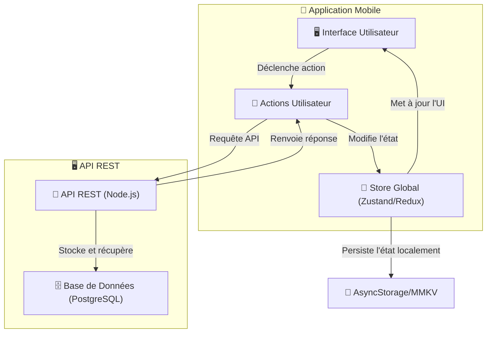

# 🏗️ **Gestion de l’État Global - Brasse-Bouillon**  

## 📌 **Introduction**  

Dans une application mobile **React Native**, la gestion de l’état global est essentielle pour **synchroniser les données entre plusieurs écrans** et **éviter la multiplication des appels API**.  

Dans **Brasse-Bouillon**, nous utilisons **Zustand (ou Redux, selon implémentation finale)** pour gérer :  
✅ **Les données utilisateur** (profil, préférences).  
✅ **Les recettes** (création, mise à jour, suppression).  
✅ **Les sessions de brassage** (étapes, temps, statuts).  
✅ **Les notifications et alertes**.  

📌 **Pourquoi une gestion d’état globale ?**  
✅ **Éviter le prop drilling** (passer des props inutiles).  
✅ **Améliorer la réactivité et la mise à jour des composants**.  
✅ **Stocker les données localement et réduire les appels API**.  

---

## 📊 **Schéma de la Gestion de l’État**  

📌 **Illustration des flux de mise à jour de l’état**  



---

## ⚙️ **Technologie utilisée**

Nous utilisons **Zustand** pour sa **simplicité** et sa **performance**, mais cette approche fonctionne également avec **Redux Toolkit**.  

📌 **Pourquoi Zustand ?**  
✅ **Simple et léger** : Moins de boilerplate que Redux.  
✅ **Performant** : Mise à jour optimisée sans besoin de reducers.  
✅ **Persistance facile** : Compatible avec `AsyncStorage` pour stocker localement.  

---

## 🔄 **Gestion des États dans l’Application**

### **1️⃣ Stockage des Données Utilisateur**

📌 **Gère les informations de l’utilisateur connecté**  

```javascript
import create from 'zustand';

export const useUserStore = create((set) => ({
  user: null,
  setUser: (userData) => set({ user: userData }),
  logout: () => set({ user: null }),
}));
```

---

### **2️⃣ Gestion des Recettes**

📌 **Stocke et met à jour les recettes sans recharger toute l’UI**  

```javascript
export const useRecipeStore = create((set) => ({
  recipes: [],
  addRecipe: (newRecipe) =>
    set((state) => ({ recipes: [...state.recipes, newRecipe] })),
  updateRecipe: (id, updatedRecipe) =>
    set((state) => ({
      recipes: state.recipes.map((r) =>
        r.id === id ? { ...r, ...updatedRecipe } : r
      ),
    })),
  deleteRecipe: (id) =>
    set((state) => ({ recipes: state.recipes.filter((r) => r.id !== id) })),
}));
```

---

### **3️⃣ Gestion des Sessions de Brassage**

📌 **Suit l’état d’une session de brassage en cours**  

```javascript
export const useSessionStore = create((set) => ({
  session: null,
  startSession: (sessionData) => set({ session: sessionData }),
  updateSession: (newData) =>
    set((state) => ({ session: { ...state.session, ...newData } })),
  endSession: () => set({ session: null }),
}));
```

---

### **4️⃣ Stockage Persistance avec AsyncStorage**

📌 **Sauvegarde l’état global pour éviter de perdre les données**  

```javascript
import AsyncStorage from '@react-native-async-storage/async-storage';
import { persist } from 'zustand/middleware';

export const usePersistedStore = create(
  persist(
    (set) => ({
      settings: { theme: 'light' },
      setSettings: (newSettings) => set({ settings: newSettings }),
    }),
    {
      name: 'brasse-bouillon-store',
      getStorage: () => AsyncStorage,
    }
  )
);
```

---

## 🚀 **Bonnes Pratiques**

✅ **Utiliser `useMemo` pour éviter les re-renders inutiles.**  
✅ **Ne pas stocker trop de données dans l’état global.**  
✅ **Gérer l’hydratation initiale de l’état persistant.**  
✅ **Bien structurer les stores pour éviter le couplage entre modules.**  

---

## 📌 **Conclusion**

Avec **Zustand**, la gestion de l’état global dans **Brasse-Bouillon** est **simple, performante et efficace**. 🎯  
💡 **Cette approche garantit une meilleure expérience utilisateur, en minimisant les appels API et en assurant une mise à jour fluide de l’UI.**  

📂 **Lieu du fichier :** `docs/architecture/frontend/state_management.md`  
