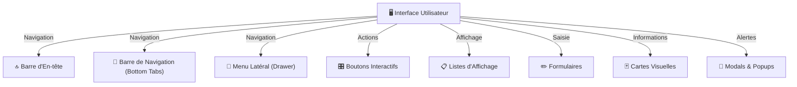

# 🎨 Composants UI - Brasse-Bouillon

## 📌 Introduction

L’interface utilisateur (UI) de **Brasse-Bouillon** repose sur des composants réutilisables permettant d’assurer une **expérience fluide et intuitive** pour les brasseurs amateurs. Cette documentation détaille **la structure des composants UI**, leurs rôles et leurs interactions avec le système.

---

## 📊 **Diagramme des Composants UI**



---

## 📖 **Détails des Composants**

### **🔝 Barre d'En-tête (Header)**

📌 Affichée en haut de chaque écran, elle contient :

- Un **titre dynamique** en fonction de l’écran.
- Des **boutons d’action** (ex : retour, menu, favoris).
- La possibilité d’afficher des **icônes personnalisées**.

### **🔽 Barre de Navigation (Bottom Tabs)**

📌 Permet de naviguer rapidement entre les sections principales :

- **Accueil** 🏠
- **Recettes** 📖
- **Sessions** 🕒
- **Profil** 👤

📌 Exemple de configuration :

```javascript
<Tab.Navigator>
  <Tab.Screen name="Home" component={HomeScreen} />
  <Tab.Screen name="Recipes" component={RecipesScreen} />
  <Tab.Screen name="Sessions" component={SessionsScreen} />
  <Tab.Screen name="Profile" component={ProfileScreen} />
</Tab.Navigator>
```

### **📂 Menu Latéral (Drawer Navigation)**

📌 Fournit un **accès rapide** aux fonctionnalités supplémentaires :

- Paramètres ⚙️
- Support 📞
- Déconnexion 🔐

### **🎛️ Boutons Interactifs**

📌 Utilisés pour exécuter des actions dans l’application :

- **Bouton principal** : Actions principales (`Valider`, `Enregistrer`).
- **Bouton secondaire** : Navigation, annulation.
- **Bouton flottant (FAB)** : Ajouter une nouvelle recette ou session.

📌 Exemple de bouton principal :

```javascript
<Button title="Ajouter une Recette" onPress={handleAddRecipe} />
```

### **📋 Listes d’Affichage**

📌 Présente les recettes, sessions et autres contenus sous forme de **listes dynamiques**.

- Permet **le scroll infini**.
- Gère les **états vides** et les **chargements**.

📌 Exemple de FlatList :

```javascript
<FlatList
  data={recipes}
  renderItem={({ item }) => <RecipeCard recipe={item} />}
  keyExtractor={(item) => item.id.toString()}
/>
```

### **✏️ Formulaires**

📌 Permettent **la saisie des informations utilisateur** (création de recette, inscription, paramètres).

- Champs texte, sliders, sélecteurs.
- Validation des entrées utilisateur.

### **🃏 Cartes Visuelles**

📌 Affichent des informations de manière attrayante et interactive.

- **Recette** : Image + titre + résumé.
- **Session en cours** : Statut + durée restante.

### **📢 Modals & Popups**

📌 Utilisés pour afficher des **informations importantes** ou demander une confirmation.

- Alertes de suppression.
- Explications et guides rapides.

📌 Exemple de modal :

```javascript
<Modal visible={isModalVisible}>
  <Text>Confirmez-vous cette action ?</Text>
  <Button title="Oui" onPress={confirmAction} />
</Modal>
```

---

## 🚀 **Bonnes Pratiques**

✔ **Utiliser des composants réutilisables** pour maintenir la cohérence UI.  
✔ **Respecter les guidelines Material Design / iOS** pour une meilleure UX.  
✔ **Gérer l’accessibilité** (`aria-label`, `accessible` pour VoiceOver).  
✔ **Optimiser les performances** (éviter les re-renders inutiles avec `useMemo`, `useCallback`).  

---

## 📌 **Conclusion**

Ce document décrit **les composants UI principaux** de **Brasse-Bouillon**. Chaque composant est optimisé pour assurer **une expérience fluide et cohérente**.

📂 **Lieu du fichier :** `docs/architecture/frontend/ui_components.md`

🚀 **Prochaine étape : Finalisation et validation du frontend !**
