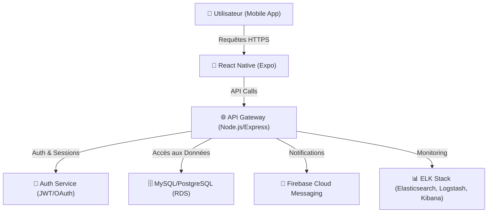

# 🏗️ **Infrastructure et Hébergement - Brasse-Bouillon**

## **1️⃣ Introduction**

🎯 **Objectif du document :**

- Décrire l’**infrastructure technique et les choix d’hébergement** du projet **Brasse-Bouillon**.
- Expliquer comment **les environnements sont organisés** et **comment les services interagissent**.
- Documenter les outils **DevOps, CI/CD et monitoring** utilisés pour assurer la stabilité du projet.

📌 **Pourquoi cette infrastructure ?**
✅ **Scalabilité et performance** : Support de la montée en charge.  
✅ **Sécurité et redondance** : Prévention des pertes de données et attaques.  
✅ **Automatisation** : CI/CD et déploiements simplifiés.  

📌 **Documents associés :**

- `architecture_overview.md` → Vue générale du projet.
- `maintenance_plan.md` → Stratégie CI/CD et mises à jour.
- `performance_optimization.md` → Optimisation des performances.
- `security_architecture.md` → Sécurité et surveillance.

---

## **2️⃣ Vue d’Ensemble de l’Infrastructure**

📌 **Architecture des services et interactions :**



📌 **Technologies principales :** Node.js, React Native, MySQL/PostgreSQL, Firebase, Docker.

📌 **Environnements hébergés sur :** AWS (EC2, RDS), DigitalOcean ou Google Cloud.

---

## **3️⃣ Gestion des Environnements**

📌 **Les environnements du projet :**

| 🌍 **Environnement** | 📌 **Utilisation** | 🏗️ **Technologie** |
|----------------|----------------|----------------|
| **Développement** | Test local et debug | `Docker`, `nodemon`, `MySQL local` |
| **Staging** | Pré-production pour tests et validation | `AWS EC2`, `PM2`, `RDS`, `Grafana` |
| **Production** | Déploiement final avec sécurité optimisée | `Docker`, `NGINX`, `CI/CD GitHub Actions` |

📌 **Documents associés :** `maintenance_plan.md`, `performance_optimization.md`.

---

## **4️⃣ Hébergement et Infrastructure Cloud**

### **🔹 Hébergement Backend et Base de Données**

📌 **Technologies utilisées :**
✅ **Backend** : AWS EC2 avec **Node.js**, API Gateway en **Express.js**.  
✅ **Base de données** : AWS RDS avec **MySQL/PostgreSQL**, sauvegardes automatisées.  
✅ **Stockage des fichiers** : AWS S3 pour les médias, logs stockés sur Elastic Stack.  

### **🔹 Services Externes Utilisés**

📌 **Liste des services cloud et intégrations :**

| 🛠️ **Service** | 📌 **Utilisation** |
|----------------|----------------|
| **Firebase Cloud Messaging (FCM)** | Notifications push mobiles |
| **AWS RDS** | Stockage sécurisé des données |
| **NGINX + Certbot** | Reverse proxy et SSL |
| **Redis (Caching)** | Accélération des requêtes API |
| **Fail2Ban** | Protection contre attaques brute-force |

---

## **5️⃣ CI/CD et Automatisation**

📌 **Pipeline CI/CD utilisé :**
✅ **GitHub Actions** pour exécuter les tests (`npm test`).  
✅ **Linting et formatage** (`npm run lint`) avant merge.  
✅ **Déploiement automatique** après validation des tests.  
✅ **Mise en production via Docker et NGINX**.

📌 **Exemple de workflow CI/CD :**

```yaml
name: CI/CD Pipeline
on:
  push:
    branches:
      - main
      - develop
jobs:
  test:
    runs-on: ubuntu-latest
    steps:
      - uses: actions/checkout@v3
      - name: Install dependencies
        run: npm install
      - name: Run tests
        run: npm test
  deploy:
    needs: test
    runs-on: ubuntu-latest
    steps:
      - name: Deploy to production
        run: echo "Déploiement en production..."
```

📌 **Documents associés :** `maintenance_plan.md`, `api_interactions.md`.

---

## **6️⃣ Surveillance, Logs et Monitoring**

📌 **Stratégie de surveillance et alertes :**
✅ **Gestion des logs** : `Winston` + `ELK Stack` (Elasticsearch, Logstash, Kibana).  
✅ **Surveillance des performances** avec **Grafana + Prometheus**.  
✅ **Alertes en cas d’erreurs** (`Slack`, `Email`).  
✅ **Protection contre attaques** avec **Fail2Ban et Rate Limiting**.

📌 **Exemple de monitoring avec PM2 :**

```bash
pm2 start server.js --name brasse-bouillon
pm2 monit
```

📌 **Documents associés :** `security_architecture.md`, `performance_optimization.md`.

---

## **7️⃣ Prochaines Étapes**

📌 **Améliorations et mises à jour futures :**
✅ Ajouter **un environnement de staging permanent**.  
✅ Intégrer **une analyse statique du code** (CodeQL, SonarQube).  
✅ Améliorer la **gestion des logs et audit de sécurité**.  

---

## **📌 Conclusion**

🎯 **L’infrastructure de Brasse-Bouillon est conçue pour être performante, sécurisée et évolutive.**
📢 **Merci de suivre ces bonnes pratiques pour un déploiement fluide et efficace ! 🚀**
