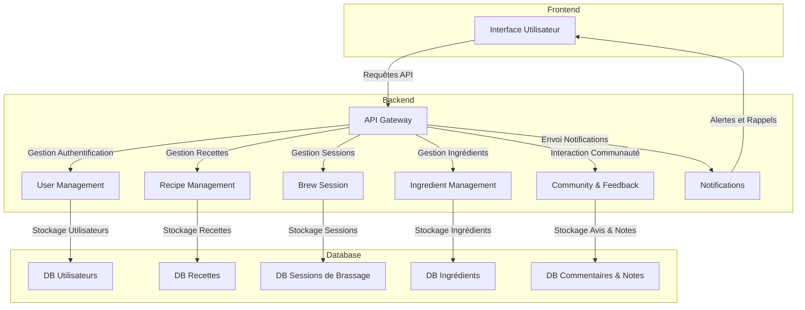

# Documentation des Modules Fonctionnels - Brasse-Bouillon

## 1. Introduction

Ce document détaille les modules principaux de l'application **Brasse-Bouillon**, leurs responsabilités et leurs interactions au sein de l'architecture globale.

---

## 2. Vue d’Ensemble des Modules

L'application est structurée en plusieurs modules interconnectés assurant la gestion des fonctionnalités principales.

| Module | Description | Responsabilité |
|--------|------------|---------------|
| **User Management** | Gestion des utilisateurs et de l'authentification | Inscription, connexion, gestion des rôles |
| **Recipe Management** | Gestion des recettes de brassage | Création, modification, partage des recettes |
| **Brew Session** | Suivi des sessions de brassage | Planification, journalisation et analyse des sessions |
| **Ingredient Management** | Gestion des ingrédients | Ajout, suppression et suivi des stocks |
| **Community & Feedback** | Interaction entre utilisateurs | Commentaires, notes et partage de recettes |
| **Notifications** | Envoi d'alertes et rappels | Suivi des brassages, alertes sur les stocks |
| **API Gateway** | Interface de communication | Gestion des requêtes entre le frontend et le backend |

---

## 3. Description Détaillée des Modules

### 3.1 User Management

📌 **Objectif** : Gérer les utilisateurs et leur authentification.

- Création et gestion de comptes utilisateurs
- Gestion des rôles et permissions
- Sécurisation via JWT (JSON Web Token)
- Réinitialisation de mot de passe

### 3.2 Recipe Management

📌 **Objectif** : Permettre la création et la gestion des recettes.

- CRUD (Create, Read, Update, Delete) des recettes
- Classification des recettes par type de bière
- Calcul automatique des paramètres (IBU, ABV...)

### 3.3 Brew Session

📌 **Objectif** : Suivi et gestion des sessions de brassage.

- Journalisation des étapes de brassage
- Suivi des paramètres critiques (température, densité...)
- Planification des brassages

### 3.4 Ingredient Management

📌 **Objectif** : Gérer les ingrédients et leur disponibilité.

- Base de données des ingrédients disponibles
- Gestion des quantités et unités de mesure
- Alerte en cas de stock bas

### 3.5 Community & Feedback

📌 **Objectif** : Interaction et retour des utilisateurs.

- Ajout de commentaires et de notes sur les recettes
- Partage de recettes avec la communauté
- Système de recommandations

### 3.6 Notifications

📌 **Objectif** : Informer les utilisateurs en temps réel.

- Alertes sur les sessions de brassage
- Notifications sur les stocks d’ingrédients
- Suivi des interactions communautaires

### 3.7 API Gateway

📌 **Objectif** : Centraliser la gestion des requêtes.

- Interface unique pour toutes les API
- Gestion des accès et de la sécurité
- Optimisation des performances via caching

---

## 4. Interactions entre les Modules

Le schéma suivant représente l’interaction entre les différents modules :

Chaque module communique avec les autres via des **APIs REST** bien définies et sécurisées.

---

