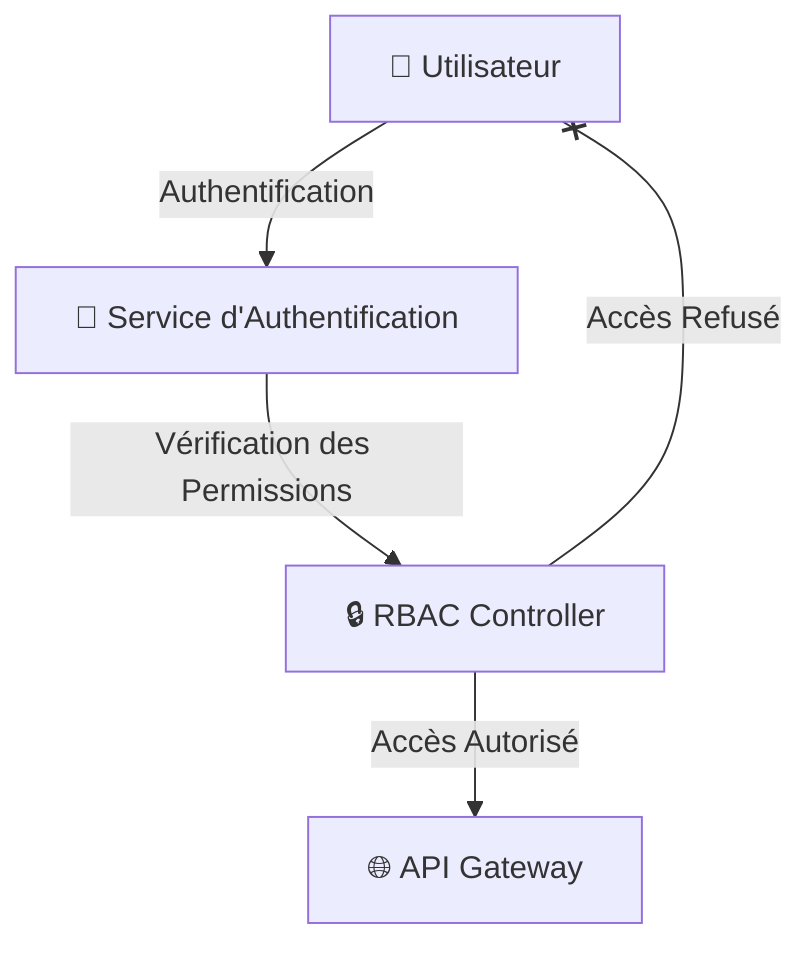

# Contrôle d'Accès et Permissions - Brasse-Bouillon

## 1. Introduction

Ce document détaille la **gestion des permissions et des rôles utilisateurs** dans le projet **Brasse-Bouillon**. L’objectif est de garantir un **contrôle strict des accès aux ressources** et d’assurer une **sécurisation optimale des fonctionnalités sensibles**.

📌 **Documents de référence :**

- **`authentication_methods.md`** : Présentation des méthodes d’authentification.
- **`security_architecture.md`** : Vue globale des mesures de sécurité.
- **`api_interactions.md`** : Définition des endpoints sécurisés.
- **`security_standards.md`** : Conformité aux standards de cybersécurité.

---

## 2. Modèle de Gestion des Accès

📌 **Méthodes utilisées pour contrôler l’accès aux ressources :**

| Type de Contrôle | Description | Utilisation |
|-----------------|-------------|-------------|
| **RBAC (Role-Based Access Control)** | Permissions définies par rôle (Admin, Brasseur, Utilisateur) | REST API et accès aux fonctionnalités |
| **ACL (Access Control List)** | Permissions granulaires sur des objets spécifiques | Gestion fine des accès utilisateurs |
| **ABAC (Attribute-Based Access Control)** | Contrôle basé sur les attributs utilisateur | Accès conditionné par contexte (localisation, device) |

---

## 3. Définition des Rôles et Permissions

📌 **Organisation des rôles utilisateurs dans Brasse-Bouillon** :

| Rôle | Permissions |
|------|------------|
| **Administrateur** | Gestion des utilisateurs, modification des recettes globales, accès total aux logs |
| **Brasseur** | Création et gestion des recettes, suivi des sessions de brassage |
| **Utilisateur** | Consultation des recettes publiques, notation et commentaires |
| **Invité** | Accès en lecture seule aux recettes publiques |

---

## 4. Sécurisation des Routes et Endpoints

📌 **Mécanisme de restriction des accès via middleware de contrôle**

```javascript
const checkRole = (roles) => {
    return (req, res, next) => {
        if (!roles.includes(req.user.role)) {
            return res.status(403).json({ message: "Accès interdit" });
        }
        next();
    };
};

app.get("/admin/dashboard", authenticate, checkRole(["admin"]), (req, res) => {
    res.json({ message: "Bienvenue sur le tableau de bord admin" });
});
```

📌 **Exemple de sécurisation des accès via RBAC :**



---

## 5. Alignement avec les Standards de Sécurité

📌 **Conformité aux meilleures pratiques de cybersécurité :**

| Standard | Application |
|----------|------------|
| **OWASP Top 10** | Protection contre les escalations de privilèges |
| **GDPR (RGPD)** | Gestion des accès aux données sensibles |
| **ISO 27001** | Contrôle des accès aux informations critiques |

---

## 6. Prochaines Étapes

📌 **Améliorations et mises à jour futures :**

- **Implémenter un système d’audit des accès pour identifier les tentatives non autorisées.**
- **Mettre en place des notifications pour les actions sensibles (modification de permissions).**
- **Effectuer un test de sécurité sur les endpoints protégés.**

---

## **Conclusion**

La **gestion des accès et des permissions** est un élément clé de la sécurité de **Brasse-Bouillon**. La mise en place de **RBAC et ACL garantit un contrôle précis des droits utilisateur** et permet d’assurer la **sécurisation des fonctionnalités sensibles**.

