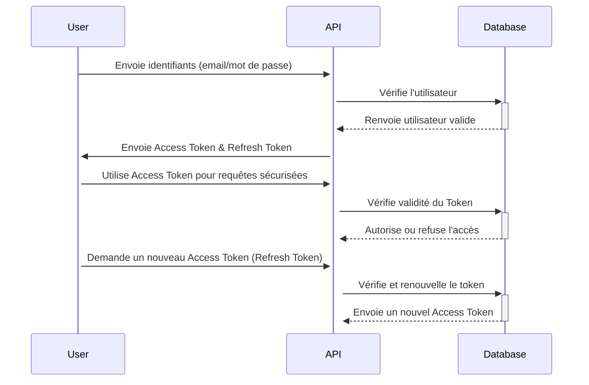

# Gestion des Sessions et des Tokens - Brasse-Bouillon

## 1. Introduction

Ce document détaille la **gestion sécurisée des sessions et des tokens d’authentification** dans le projet **Brasse-Bouillon**. L’objectif est de garantir **une protection optimale des utilisateurs**, en minimisant les risques liés aux sessions ouvertes et en respectant les bonnes pratiques de cybersécurité.

📌 **Documents de référence :**

- **`authentication_methods.md`** : Explication des méthodes d’authentification.
- **`security_architecture.md`** : Vue globale des mesures de sécurité.
- **`api_interactions.md`** : Gestion des sessions via les API.
- **`security_standards.md`** : Conformité aux standards OWASP et RGPD.

---

## 2. Principes de Sécurité des Sessions

📌 **Objectifs de sécurité :**

- **Limiter la durée de vie des sessions** pour éviter les abus.
- **Sécuriser le stockage et la transmission des tokens**.
- **Prévenir les attaques par vol de session (XSS, CSRF, fixation de session).**

📌 **Types de tokens utilisés :**

| Type de Token | Rôle | Durée de vie | Stockage |
|--------------|------|-------------|----------|
| **Access Token (JWT)** | Authentification rapide | 15 à 30 minutes | HttpOnly Cookie |
| **Refresh Token** | Renouvellement de session | 7 à 14 jours | Stocké côté serveur |

---

## 3. Gestion des Tokens et Sessions

### 🔹 **Cycle de vie des sessions et renouvellement des tokens**

### 🔹 **Bonnes pratiques de stockage des tokens**

| Pratique | Description |
|------------|----------------|
| **HttpOnly Cookie** | Stocke le JWT pour éviter les attaques XSS |
| **Expiration courte des tokens** | Réduit l’impact d’un vol de session |
| **Rotation des Refresh Tokens** | Sécurité renforcée lors du renouvellement |
| **Blacklist des Refresh Tokens** | Empêche l’utilisation frauduleuse des tokens révoqués |

### 🔹 **Protection contre les attaques**

| Attaque | Solution mise en place |
|---------|------------------------|
| **XSS (Cross-Site Scripting)** | Utilisation de HttpOnly Cookie |
| **CSRF (Cross-Site Request Forgery)** | Mise en place de tokens CSRF |
| **Fixation de session** | Génération de nouveaux tokens après connexion |
| **Rejeu de token** | Ajout d’un mécanisme de validation côté serveur |

---

## 4. Alignement avec les Standards de Sécurité

📌 **Conformité avec les bonnes pratiques de cybersécurité :**

| Standard | Application |
|----------|------------|
| **OWASP Top 10** | Protection contre XSS, CSRF, Session Hijacking |
| **GDPR (RGPD)** | Sécurisation des données utilisateur et anonymisation |
| **ISO 27001** | Gestion sécurisée des accès et des sessions |

---

## 5. Prochaines Étapes

📌 **Améliorations et mises à jour futures :**

- **Implémenter un mécanisme de détection des sessions suspectes.**
- **Mettre en place une alerte pour activité inhabituelle.**
- **Tester les vulnérabilités via des audits de sécurité et tests de pénétration.**

---

## **Conclusion**

La **gestion sécurisée des sessions et des tokens** est essentielle pour protéger les utilisateurs contre les attaques et garantir un **environnement sécurisé** sur Brasse-Bouillon.
