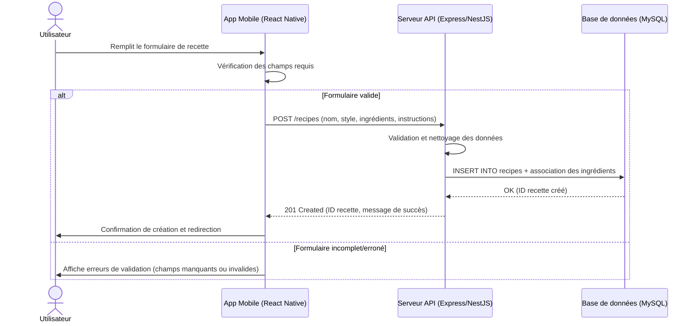

```mermaid
    sequenceDiagram
    actor Utilisateur
    participant Frontend as App Mobile (React Native)
    participant Backend as Serveur API (Express/NestJS)
    participant DB as Base de données (MySQL)

    %% Création d'une nouvelle recette
    Utilisateur->>Frontend: Remplit le formulaire de recette
    Frontend->>Frontend: Vérification des champs requis
    alt Formulaire valide
        Frontend->>Backend: POST /recipes (nom, style, ingrédients, instructions)
        Backend->>Backend: Validation et nettoyage des données
        Backend->>DB: INSERT INTO recipes + association des ingrédients
        DB-->>Backend: OK (ID recette créé)
        Backend-->>Frontend: 201 Created (ID recette, message de succès)
        Frontend->>Utilisateur: Confirmation de création et redirection
    else Formulaire incomplet/erroné
        Frontend->>Utilisateur: Affiche erreurs de validation (champs manquants ou invalides)
    end
```