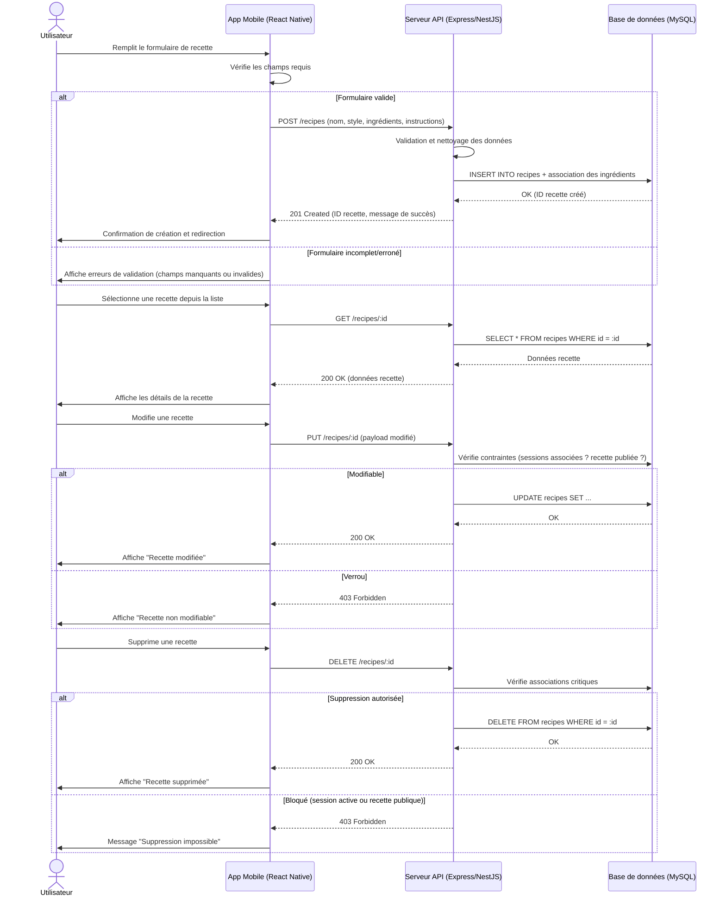

```mermaid
    sequenceDiagram
    actor Utilisateur
    participant Frontend as App Mobile (React Native)
    participant Backend as Serveur API (Express/NestJS)
    participant DB as Base de données (MySQL)

    %% Création d'une nouvelle recette
    Utilisateur->>Frontend: Remplit le formulaire de recette
    Frontend->>Frontend: Vérifie les champs requis
    alt Formulaire valide
        Frontend->>Backend: POST /recipes (nom, style, ingrédients, instructions)
        Backend->>Backend: Validation et nettoyage des données
        Backend->>DB: INSERT INTO recipes + association des ingrédients
        DB-->>Backend: OK (ID recette créé)
        Backend-->>Frontend: 201 Created (ID recette, message de succès)
        Frontend->>Utilisateur: Confirmation de création et redirection
    else Formulaire incomplet/erroné
        Frontend->>Utilisateur: Affiche erreurs de validation (champs manquants ou invalides)
    end

    %% Consultation d'une recette
    Utilisateur->>Frontend: Sélectionne une recette depuis la liste
    Frontend->>Backend: GET /recipes/:id
    Backend->>DB: SELECT * FROM recipes WHERE id = :id
    DB-->>Backend: Données recette
    Backend-->>Frontend: 200 OK (données recette)
    Frontend->>Utilisateur: Affiche les détails de la recette

    %% Modification d'une recette
    Utilisateur->>Frontend: Modifie une recette
    Frontend->>Backend: PUT /recipes/:id (payload modifié)
    Backend->>DB: Vérifie contraintes (sessions associées ? recette publiée ?)
    alt Modifiable
        Backend->>DB: UPDATE recipes SET ...
        DB-->>Backend: OK
        Backend-->>Frontend: 200 OK
        Frontend->>Utilisateur: Affiche "Recette modifiée"
    else Verrou
        Backend-->>Frontend: 403 Forbidden
        Frontend->>Utilisateur: Affiche "Recette non modifiable"
    end

    %% Suppression d'une recette
    Utilisateur->>Frontend: Supprime une recette
    Frontend->>Backend: DELETE /recipes/:id
    Backend->>DB: Vérifie associations critiques
    alt Suppression autorisée
        Backend->>DB: DELETE FROM recipes WHERE id = :id
        DB-->>Backend: OK
        Backend-->>Frontend: 200 OK
        Frontend->>Utilisateur: Affiche "Recette supprimée"
    else Bloqué (session active ou recette publique)
        Backend-->>Frontend: 403 Forbidden
        Frontend->>Utilisateur: Message "Suppression impossible"
    end


```