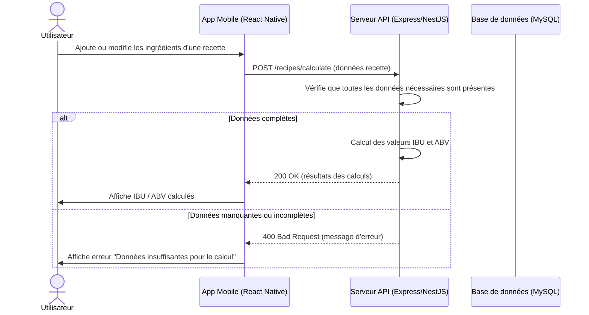

```mermaid
    sequenceDiagram
    actor Utilisateur
    participant Frontend as App Mobile (React Native)
    participant Backend as Serveur API (Express/NestJS)
    participant DB as Base de données (MySQL)

    %% Calcul automatique de l'IBU et de l'ABV
    Utilisateur->>Frontend: Ajoute ou modifie les ingrédients d'une recette
    Frontend->>Backend: POST /recipes/calculate (données recette)
    Backend->>Backend: Vérifie que toutes les données nécessaires sont présentes
    alt Données complètes
        Backend->>Backend: Calcul des valeurs IBU et ABV
        Backend-->>Frontend: 200 OK (résultats des calculs)
        Frontend->>Utilisateur: Affiche IBU / ABV calculés
    else Données manquantes ou incomplètes
        Backend-->>Frontend: 400 Bad Request (message d'erreur)
        Frontend->>Utilisateur: Affiche erreur "Données insuffisantes pour le calcul"
    end

```