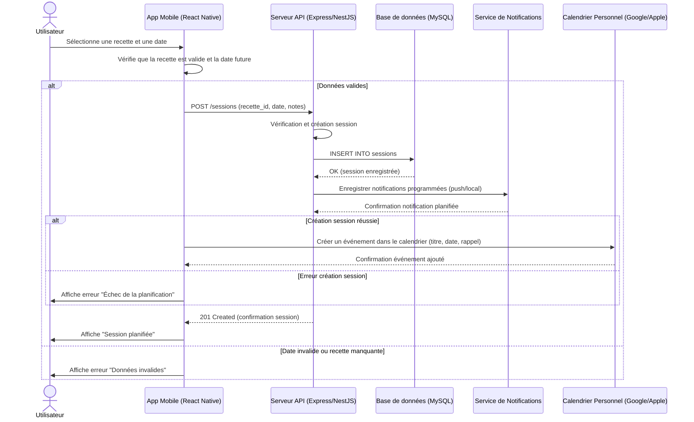

```mermaid
sequenceDiagram
    actor Utilisateur
    participant Frontend as App Mobile (React Native)
    participant Backend as Serveur API (Express/NestJS)
    participant DB as Base de données (MySQL)
    participant Notif as Service de Notifications
    participant Calendar as Calendrier Personnel (Google/Apple)

    %% Planification d'une session de brassage
    Utilisateur->>Frontend: Sélectionne une recette et une date
    Frontend->>Frontend: Vérifie que la recette est valide et la date future
    alt Données valides
        Frontend->>Backend: POST /sessions (recette_id, date, notes)
        Backend->>Backend: Vérification et création session
        Backend->>DB: INSERT INTO sessions
        DB-->>Backend: OK (session enregistrée)
        Backend->>Notif: Enregistrer notifications programmées (push/local)
        Notif-->>Backend: Confirmation notification planifiée
        alt Création session réussie
            Frontend->>Calendar: Créer un événement dans le calendrier (titre, date, rappel)
            Calendar-->>Frontend: Confirmation événement ajouté
        else Erreur création session
            Frontend->>Utilisateur: Affiche erreur "Échec de la planification"
        end
        Backend-->>Frontend: 201 Created (confirmation session)
        Frontend->>Utilisateur: Affiche "Session planifiée"
    else Date invalide ou recette manquante
        Frontend->>Utilisateur: Affiche erreur "Données invalides"
    end

```