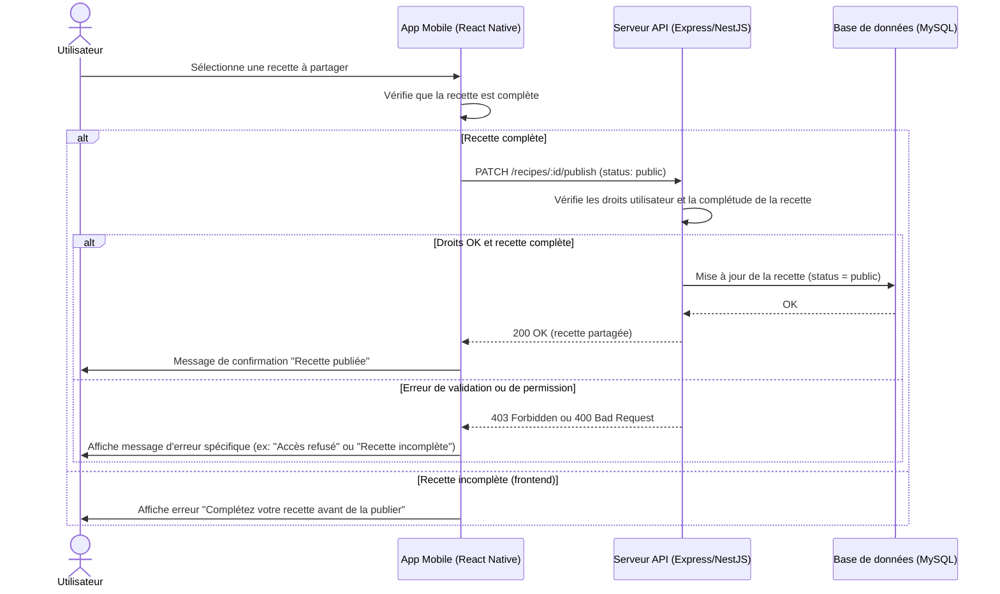

```mermaid
    sequenceDiagram
    actor Utilisateur
    participant Frontend as App Mobile (React Native)
    participant Backend as Serveur API (Express/NestJS)
    participant DB as Base de données (MySQL)

    %% Partage communautaire d'une recette
    Utilisateur->>Frontend: Sélectionne une recette à partager
    Frontend->>Frontend: Vérifie que la recette est complète
    alt Recette complète
        Frontend->>Backend: PATCH /recipes/:id/publish (status: public)
        Backend->>Backend: Vérifie les droits utilisateur et la complétude de la recette
        alt Droits OK et recette complète
            Backend->>DB: Mise à jour de la recette (status = public)
            DB-->>Backend: OK
            Backend-->>Frontend: 200 OK (recette partagée)
            Frontend->>Utilisateur: Message de confirmation "Recette publiée"
        else Erreur de validation ou de permission
            Backend-->>Frontend: 403 Forbidden ou 400 Bad Request
            Frontend->>Utilisateur: Affiche message d'erreur spécifique (ex: "Accès refusé" ou "Recette incomplète")
        end
    else Recette incomplète (frontend)
        Frontend->>Utilisateur: Affiche erreur "Complétez votre recette avant de la publier"
    end

```