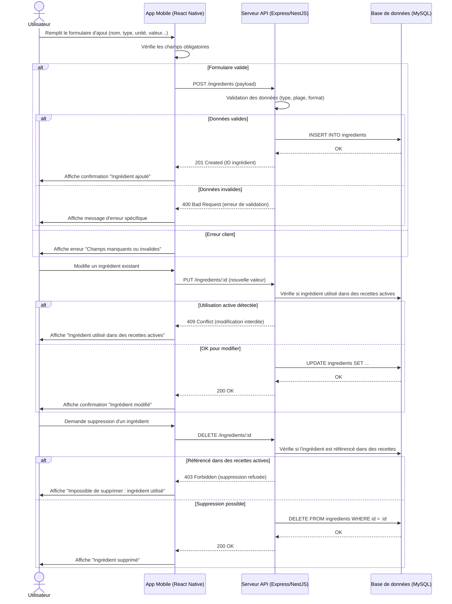

```mermaid
    sequenceDiagram
    actor Utilisateur
    participant Frontend as App Mobile (React Native)
    participant Backend as Serveur API (Express/NestJS)
    participant DB as Base de données (MySQL)

    %% Ajout d'un ingrédient
    Utilisateur->>Frontend: Remplit le formulaire d'ajout (nom, type, unité, valeur...)
    Frontend->>Frontend: Vérifie les champs obligatoires
    alt Formulaire valide
        Frontend->>Backend: POST /ingredients (payload)
        Backend->>Backend: Validation des données (type, plage, format)
        alt Données valides
            Backend->>DB: INSERT INTO ingredients
            DB-->>Backend: OK
            Backend-->>Frontend: 201 Created (ID ingrédient)
            Frontend->>Utilisateur: Affiche confirmation "Ingrédient ajouté"
        else Données invalides
            Backend-->>Frontend: 400 Bad Request (erreur de validation)
            Frontend->>Utilisateur: Affiche message d'erreur spécifique
        end
    else Erreur client
        Frontend->>Utilisateur: Affiche erreur "Champs manquants ou invalides"
    end

    %% Modification d'un ingrédient
    Utilisateur->>Frontend: Modifie un ingrédient existant
    Frontend->>Backend: PUT /ingredients/:id (nouvelle valeur)
    Backend->>DB: Vérifie si ingrédient utilisé dans des recettes actives
    alt Utilisation active détectée
        Backend-->>Frontend: 409 Conflict (modification interdite)
        Frontend->>Utilisateur: Affiche "Ingrédient utilisé dans des recettes actives"
    else OK pour modifier
        Backend->>DB: UPDATE ingredients SET ...
        DB-->>Backend: OK
        Backend-->>Frontend: 200 OK
        Frontend->>Utilisateur: Affiche confirmation "Ingrédient modifié"
    end

    %% Suppression d'un ingrédient
    Utilisateur->>Frontend: Demande suppression d'un ingrédient
    Frontend->>Backend: DELETE /ingredients/:id
    Backend->>DB: Vérifie si l'ingrédient est référencé dans des recettes
    alt Référencé dans des recettes actives
        Backend-->>Frontend: 403 Forbidden (suppression refusée)
        Frontend->>Utilisateur: Affiche "Impossible de supprimer : ingrédient utilisé"
    else Suppression possible
        Backend->>DB: DELETE FROM ingredients WHERE id = :id
        DB-->>Backend: OK
        Backend-->>Frontend: 200 OK
        Frontend->>Utilisateur: Affiche "Ingrédient supprimé"
    end

```