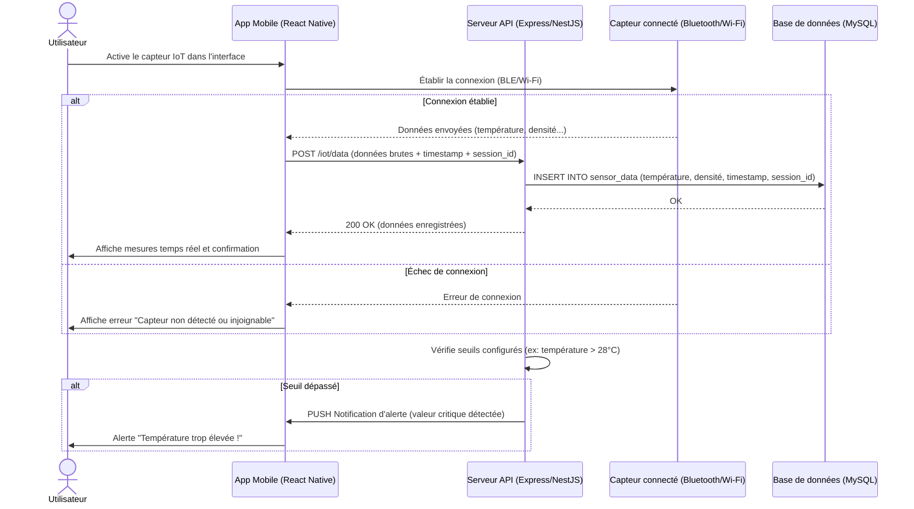

```mermaid
    sequenceDiagram
    actor Utilisateur
    participant Frontend as App Mobile (React Native)
    participant Backend as Serveur API (Express/NestJS)
    participant IoT as Capteur connecté (Bluetooth/Wi-Fi)
    participant DB as Base de données (MySQL)

    %% Connexion et utilisation d’un capteur IoT
    Utilisateur->>Frontend: Active le capteur IoT dans l'interface
    Frontend->>IoT: Établir la connexion (BLE/Wi-Fi)
    alt Connexion établie
        IoT-->>Frontend: Données envoyées (température, densité...)
        Frontend->>Backend: POST /iot/data (données brutes + timestamp + session_id)
        Backend->>DB: INSERT INTO sensor_data (température, densité, timestamp, session_id)
        DB-->>Backend: OK
        Backend-->>Frontend: 200 OK (données enregistrées)
        Frontend->>Utilisateur: Affiche mesures temps réel et confirmation
    else Échec de connexion
        IoT-->>Frontend: Erreur de connexion
        Frontend->>Utilisateur: Affiche erreur "Capteur non détecté ou injoignable"
    end

    %% Notification automatique si seuil critique
    Backend->>Backend: Vérifie seuils configurés (ex: température > 28°C)
    alt Seuil dépassé
        Backend->>Frontend: PUSH Notification d'alerte (valeur critique détectée)
        Frontend->>Utilisateur: Alerte "Température trop élevée !"
    end

```