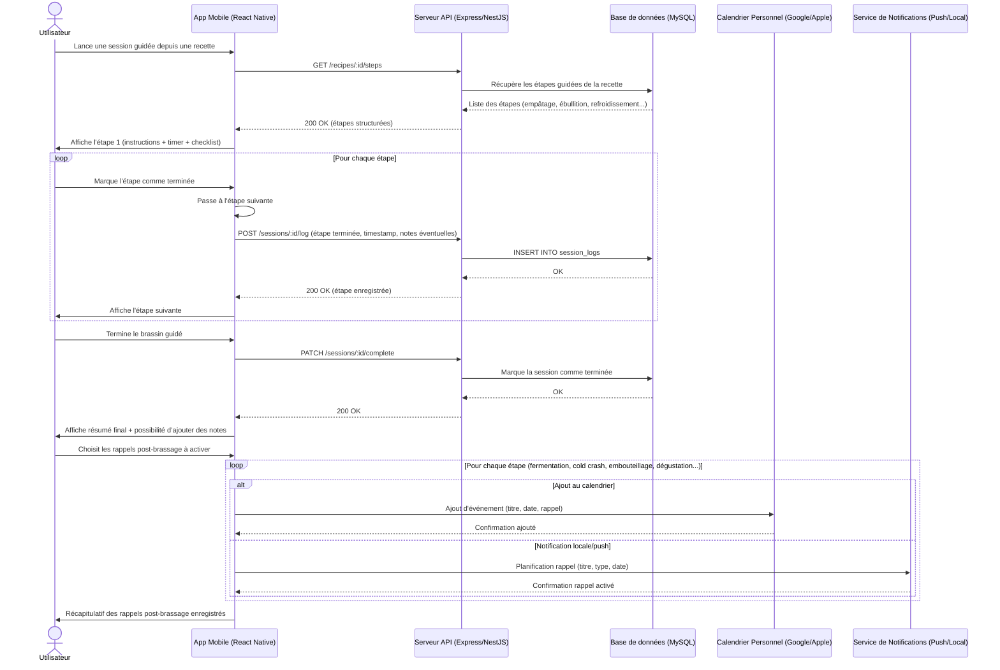

# ✅ Brasse-Bouillon – Checklist des Actions Post-Brassage

Ce document rassemble toutes les étapes essentielles à planifier après une session de brassage, sous forme de rappels (calendrier) ou de notifications (smartphone), afin d’assurer un suivi rigoureux et structuré du brassin.

---

## 📅 Étapes Critiques à Planifier Après le Brassage

| Étape | Délai conseillé | Rappel Calendrier | Notification Smartphone | Notes |
|-------|------------------|-------------------|--------------------------|-------|
| **1. Contrôle température fermentation** | Immédiat + quotidien | ✅ Oui | ✅ Oui (quotidienne) | Température stable = fermentation saine |
| **2. Vérification activité (bulles, densité)** | J+1 / J+2 | ✅ Oui | ✅ Oui | Vérification du bon démarrage de la fermentation |
| **3. Mesure de densité intermédiaire** | J+3 à J+5 | ✅ Oui | ✅ Oui | Suivi de la progression |
| **4. Transfert en secondaire (si applicable)** | J+7 à J+14 | ✅ Oui | ✅ Oui | Pour clarification, selon la méthode choisie |
| **5. Vérification de fin de fermentation** | J+10 à J+14 | ✅ Oui | ✅ Oui | Densité stable sur plusieurs jours |
| **6. Cold crash** | J+14 à J+16 | ✅ Oui | ✅ Oui | Refroidissement à 0–4°C pour clarifier la bière |
| **7. Embouteillage / Kegging** | J+15 à J+21 | ✅ Oui | ✅ Oui | Étape clé pour préparer le conditionnement |
| **8. Suivi de la carbonatation** | J+21 → J+35 | ✅ Oui | ✅ Oui (hebdo) | Repos en bouteille à température ambiante |
| **9. Dégustation finale** | J+30 à J+45 | ✅ Oui | 🔔 Optionnelle | Dernière vérification, puis moment festif 🎉 |

---

## 📲 Intégration dans l'Application

- Proposer à l'utilisateur de **sélectionner les rappels souhaités** à la fin de la session guidée.
- Deux canaux disponibles :
  - 📅 **Calendrier personnel** (Google / Apple)
  - 🔔 **Notifications locales/push** dans l'application mobile
- Offrir la possibilité de **personnaliser le calendrier** (ex. : planifier l’embouteillage à J+17 plutôt que J+15).

---

## 💡 Recommandation UX

Un écran de synthèse "📌 Planification des prochaines étapes" devrait apparaître automatiquement à la fin du brassin guidé. Les rappels les plus fréquents y seraient pré-cochés, avec possibilité d’ajuster chaque événement.

---

## 🔗 Liens Associés

- [DS08 – Guidage brassin étape par étape]
- [docs/architecture/sequence_diagrams/ds08-guidage.md]

---

## 📡 Intégration IoT (Optionnelle)

Si l’utilisateur dispose de capteurs connectés (thermomètre, hygromètre, densimètre, etc.), le suivi des étapes post-brassage peut être **automatisé** :

- Relevés temps réel
- Transmission directe au backend
- Visualisation dans l'application

En l'absence de ces dispositifs, l'utilisateur pourra **enregistrer manuellement** les mesures importantes via un **formulaire adapté** à chaque étape. Cela garantit un bon suivi, même sans matériel connecté.

---

Cette checklist peut évoluer selon les retours utilisateurs et les styles de brassage. Elle constitue néanmoins une base solide pour accompagner efficacement les brasseurs amateurs dans leur parcours post-brassage.
