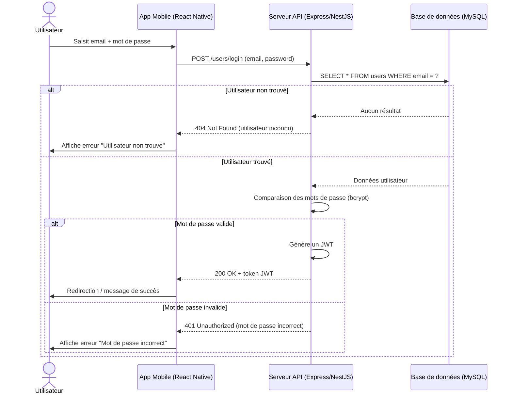

```mermaid
sequenceDiagram
    actor Utilisateur
    participant Frontend as App Mobile (React Native)
    participant Backend as Serveur API (Express/NestJS)
    participant DB as Base de données (MySQL)

    %% Connexion de l'utilisateur
    Utilisateur->>Frontend: Saisit email + mot de passe
    Frontend->>Backend: POST /users/login (email, password)
    Backend->>DB: SELECT * FROM users WHERE email = ?
    alt Utilisateur non trouvé
        DB-->>Backend: Aucun résultat
        Backend-->>Frontend: 404 Not Found (utilisateur inconnu)
        Frontend->>Utilisateur: Affiche erreur "Utilisateur non trouvé"
    else Utilisateur trouvé
        DB-->>Backend: Données utilisateur
        Backend->>Backend: Comparaison des mots de passe (bcrypt)
        alt Mot de passe valide
            Backend->>Backend: Génère un JWT
            Backend-->>Frontend: 200 OK + token JWT
            Frontend->>Utilisateur: Redirection / message de succès
        else Mot de passe invalide
            Backend-->>Frontend: 401 Unauthorized (mot de passe incorrect)
            Frontend->>Utilisateur: Affiche erreur "Mot de passe incorrect"
        end
    end
```
