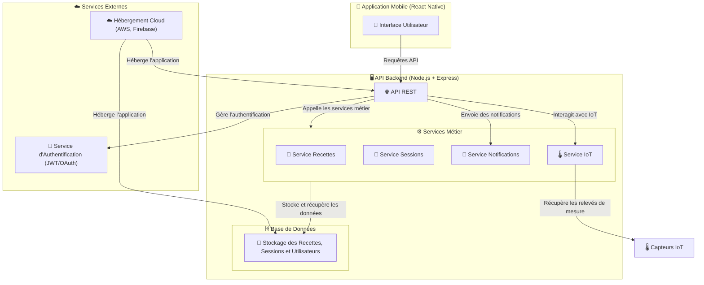

# 🏗️ **Vue d’Ensemble de l’Architecture - Brasse-Bouillon**  

Ce document présente **l’architecture technique globale** de l’application **Brasse-Bouillon**, en distinguant **les couches Frontend, Backend, Base de Données, Services Métier et Services Externes**.  

---

## 📊 **Diagramme Global de l’Architecture**

📌 **Représentation complète des composants du projet.**  

---

## **📌 Explication de l’Architecture**

📌 **L’architecture est divisée en plusieurs couches distinctes :**  

### **1️⃣ 📱 Frontend (React Native)**

- **Application mobile utilisée par les brasseurs amateurs.**  
- **Envoie des requêtes à l’API Backend.**  
- **Affiche les données en temps réel des capteurs IoT.**  

### **2️⃣ 🌐 Backend API (Node.js + Express)**

- **Point central de communication entre le Frontend et les autres services.**  
- **Gère les requêtes API et les routes pour chaque service métier.**  
- **Gère l’authentification des utilisateurs (JWT, OAuth).**  

### **3️⃣ ⚙️ Services Métier**

📌 **Chaque service est indépendant et organisé selon une logique métier.**  

| 📂 **Service** | 📌 **Rôle** |
|--------------|----------------|
| **Recettes (`RecipeService`)** | CRUD des recettes et gestion des ingrédients. |
| **Sessions (`SessionService`)** | Gestion et suivi des sessions de brassage. |
| **Notifications (`NotificationService`)** | Envoi d’alertes et rappels utilisateurs. |
| **IoT (`IoTService`)** | Communication avec les capteurs (température, densité, pression). |

### **4️⃣ 🗄️ Base de Données (PostgreSQL / MySQL)**

📌 **Stocke toutes les informations essentielles de l’application :**  

- **Utilisateurs et authentification.**  
- **Recettes et sessions de brassage.**  
- **Relevés des capteurs IoT.**  

### **5️⃣ ☁️ Services Externes**

📌 **Connexion avec des services tiers pour l’authentification et le stockage :**  

- **JWT / OAuth 2.0** → Authentification des utilisateurs.  
- **Firebase / AWS** → Hébergement et stockage sécurisé des données.  
