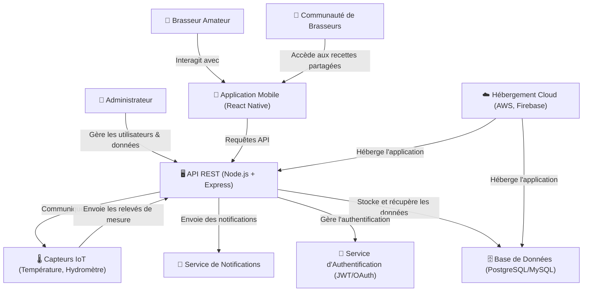

```mermaid
    graph TD;
        %% Définition des acteurs principaux
        U["👤 Brasseur Amateur"]
        P["👥 Communauté de Brasseurs"]
        Admin["🔧 Administrateur"]

        %% Définition des composants principaux
        App["📱 Application Mobile (React Native)"]
        Backend["🖥️ API REST (Node.js + Express)"]
        DB["🗄️ Base de Données (PostgreSQL/MySQL)"]
        IoT["🌡️ Capteurs IoT (Température, Hydromètre)"]
        Notifications["📢 Service de Notifications"]
        
        %% Services externes potentiels
        Auth["🔑 Service d'Authentification (JWT/OAuth)"]
        Cloud["☁️ Hébergement Cloud (AWS, Firebase)"]

        %% Relations principales
        U -->|Interagit avec| App
        P -->|Accède aux recettes partagées| App
        Admin -->|Gère les utilisateurs & données| Backend
        
        %% Connexions techniques
        App -->|Requêtes API| Backend
        Backend -->|Stocke et récupère les données| DB
        Backend -->|Gère l'authentification| Auth
        Backend -->|Envoie des notifications| Notifications
        Backend -->|Communique avec| IoT
        IoT -->|Envoie les relevés de mesure| Backend
        Cloud -->|Héberge l'application| Backend & DB
```
