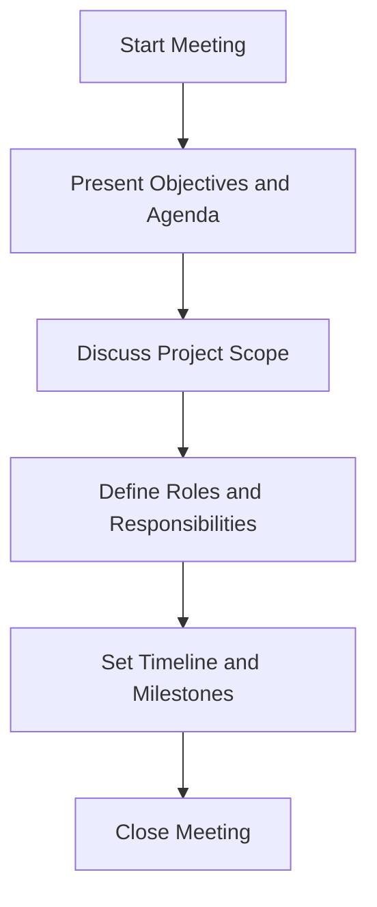
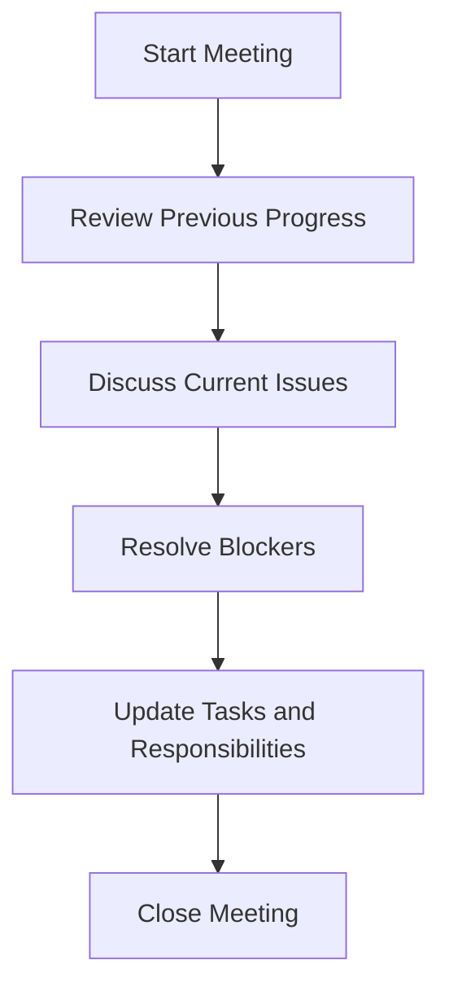
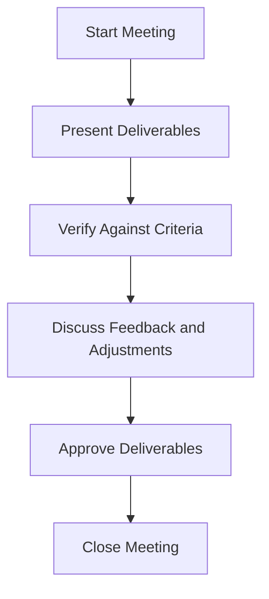

## Identification des Types de Réunions

### **Introduction**

Dans le cadre du projet **BeerToBeer**, une étude a été menée pour identifier les types de réunions nécessaires, leurs objectifs principaux, et les éléments essentiels à inclure pour chaque type. L’objectif est de standardiser les formats de réunions afin d’assurer une communication efficace et homogène tout au long du projet.

---

### **1. Types de Réunions Standardisées**

#### **1.1. Réunion Kick-off**

- **Description** : Réunion initiale d’une phase ou d’un projet pour aligner les équipes sur les objectifs et priorités.
- **Objectifs** :
  - Définir les priorités et objectifs clés.
  - Identifier les rôles et responsabilités.
  - Valider le calendrier et les jalons principaux.
- **Éléments Essentiels** :
  - **Participants** : Responsables de phase, parties prenantes, membres de l’équipe.
  - **Ordre du jour** :
    - Présentation des objectifs et du contexte.
    - Discussion sur le périmètre du projet.
    - Attribution des rôles et responsabilités.
    - Planification initiale des jalons.
  - **Résultats attendus** :
    - Feuille de route validée.
    - Priorités et responsabilités attribuées.

#### **1.2. Réunion de Suivi**

- **Description** : Réunions régulières pour évaluer l’avancement et résoudre les points bloquants.
- **Objectifs** :
  - Suivre les progrès par rapport aux objectifs définis.
  - Identifier et résoudre les problèmes et blocages.
  - Réaligner les priorités si nécessaire.
- **Éléments Essentiels** :
  - **Participants** : Équipe opérationnelle, responsable projet.
  - **Ordre du jour** :
    - Revue des progrès réalisés depuis la dernière réunion.
    - Identification des points bloquants et analyse des risques.
    - Discussion sur les ajustements nécessaires.
    - Mise à jour des tâches et des échéances.
  - **Résultats attendus** :
    - Liste des actions mise à jour.
    - Blocages résolus ou plan d’action défini.
    - Statut des jalons et des tâches validé.

#### **1.3. Réunion de Validation**

- **Description** : Réunion finale pour valider les livrables d’une phase ou d’un projet.
- **Objectifs** :
  - Vérifier que les livrables respectent les critères d’acceptation.
  - Obtenir une approbation formelle pour clôturer la phase.
  - Identifier les ajustements nécessaires avant de passer à l’étape suivante.
- **Éléments Essentiels** :
  - **Participants** : Responsable projet, membres de l’équipe, parties prenantes.
  - **Ordre du jour** :
    - Présentation des livrables.
    - Comparaison avec les critères d’acceptation.
    - Discussion des ajustements nécessaires.
    - Validation ou rejet des livrables.
  - **Résultats attendus** :
    - Livrables validés ou plan de correction défini.
    - Décisions formalisées pour clôturer la phase.
    - Prochaine étape planifiée.

---

### **2. Diagrammes Visuels**

#### **Diagramme Kick-off (Mermaid)**

#### **Diagramme Suivi (Mermaid)**

#### **Diagramme Validation (Mermaid)**

---

### **3. Suggestions d’Optimisation**

1. **Ajout de Durées Estimées** : Définir un temps précis pour chaque étape de chaque type de réunion afin d’éviter les dérives temporelles.
2. **Processus Post-Réunion** : Inclure une étape de suivi pour vérifier l’état des actions décidées pendant la réunion.
3. **Validation par l’Équipe** : Tester ces formats lors de réunions pilotes et collecter les retours pour ajuster les modèles si nécessaire.

---

### **4. Livrables**

1. Documentation détaillée des types de réunions, incluant les objectifs, les participants, les éléments essentiels et les résultats attendus.
2. Diagrammes Mermaid pour une visualisation claire du déroulé de chaque réunion.
3. Bases pour la création de templates GitHub liés aux réunions.
