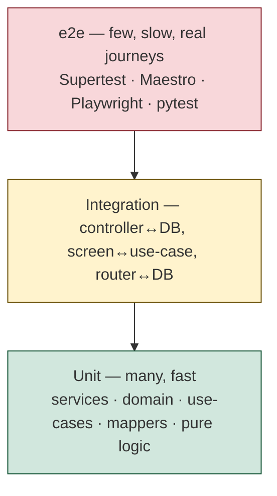

# Testing strategy — Brasse-Bouillon

> **Status**: living document. Contract: [ADR-0019 — Testing strategy & quality
> gates](../architecture/decisions/0019-testing-strategy-and-quality-gates.md).
> This document is the **"how"** (the detail the test code must satisfy); the ADR
> is the **"what we commit to"**. Language: English (per `docs/CONVENTIONS.md`).

This is the single reference for how Brasse-Bouillon is tested across its four
packages. It defines the test pyramid, what each layer covers per package, the
e2e tooling, the coverage policy, and the target CI gates. It supersedes nothing —
it **consolidates** the conventions previously scattered across the Definition of
Done, `CONTRIBUTING.md`, and the per-package `CLAUDE.md` files.

---

## 1. The test pyramid

- **Base (unit)** — the bulk of tests. Pure logic, services, domain factories,
  use-cases, API mappers. Fast, no I/O, deterministic. The codebase is already
  strong here.
- **Middle (integration)** — a thinner band. Real wiring across a seam:
  controller↔DB (Supertest on in-memory SQLite), screen↔use-case (React Native
  Testing Library), router↔DB (FastAPI `TestClient`).
- **Top (e2e)** — deliberately **few**, covering only the **real, high-risk
  journeys**. Slow and broad; never the place to assert business-rule branches
  (those belong at the unit layer).

**Anti-goal**: an inverted pyramid (many slow e2e, few unit). If a behaviour can be
asserted one layer down, it is tested there.

---

## 2. Per-package map

| Package | Unit | Integration | e2e (tool) | Coverage target (ratchet) |
|---|---|---|---|---|
| **api** (NestJS) | services, domain, DTO validators (Jest) | controller↔DB (Supertest, in-memory SQLite + migrations) | `POST /recipes/match` + auth/recipes journeys (**Supertest**) | floor now → **80%** |
| **mobile-app** (Expo/RN) | use-cases, mappers, pure logic (Jest) | screen↔use-case (React Native Testing Library) | scan → fiche → equivalents / honest empty state (**Maestro**) | floor now → **80%** |
| **beer-encyclopedia** (FastAPI) | `ml/extract`, recommender, persistence (pytest) | router↔DB (`TestClient`, in-memory SQLite) | import-by-ean via OpenFoodFacts (**pytest**) | floor now → **75%** |
| **website** (static) | — | structural quality gate (`scripts/quality_gate.py`, existing) | home renders + feedback widget + form posts (**Playwright**) | n/a (structural gate) |

Measured baseline (2026-06-17): api 88 unit + 5 e2e specs; mobile-app 99 test
files; beer-encyclopedia 18 pytest files; website 9 structural checks.

---

## 3. Per-package detail

### 3.1 api (NestJS)

- **Unit** — co-located `*.spec.ts` under `src/`. Mock TypeORM repositories; test
  services and domain in isolation. Reuse the existing helpers:
  `src/recipe/recipe-testing.module.ts` (`buildRecipeTestingTypeOrm()`) and
  `src/database/seeds/seed-test-utils.ts` (`buildRepoMock()`,
  `assertCommonCatalogueSeederBehaviours()`).
- **Integration / e2e** — `test/*.e2e-spec.ts`, run via `test/jest-e2e.json` with
  `--runInBand`, booting the full `AppModule` on `DATABASE_PATH=:memory:` with
  `TYPEORM_MIGRATIONS_RUN=true`. Existing specs: `app`, `auth.protected`,
  `health`, `feedback`, `recipes-public`.
- **Priority gaps to close** (backlog):
  - e2e on `POST /recipes/match` — pin matcher v2 (ADR-0016): a real Blonde Ale
    recipe ranks above a same-family Saison, above an off-family NEIPA; an
    off-family official does not bypass the D5/D6 gate.
  - Missing unit specs: the `label` module (3 controllers + 3 services),
    `recipe.service`, `recipe-ingredients.service`, `scan-storage.service`,
    `password.service`.

### 3.2 mobile-app (Expo / React Native)

- **Unit** — `src/features/<feature>/application/__tests__/` (use-cases) and
  `.../data/__tests__/` (API clients/mappers). Mock `@/core/http/http-client` with
  `jest.fn()`; never hit real HTTP. Reuse fixtures
  (`src/features/labels/test-utils/label-test-fixtures.ts`, `src/mocks/demo-data.ts`).
- **Integration** — `src/features/<feature>/presentation/__tests__/` with React
  Native Testing Library; mock the use-case layer, render the screen, assert
  interactions. Wrap in `QueryClientProvider` (`retry: false`).
- **e2e (Maestro, new)** — YAML flows under `.maestro/`. First flow: scan a known
  barcode → beer fiche → "recettes équivalentes" populated (or the honest empty
  state when none clear the threshold).
- **Priority gaps to close** (backlog): introduce Maestro + the scan flow; add the
  missing unit test for the `equipment` screen (only untested feature).

### 3.3 beer-encyclopedia (FastAPI)

- **Unit** — pytest under `tests/`, `tests/test_<module>_<behavior>.py`. Async via
  `pytest-asyncio` (auto mode).
- **Integration** — `tests/test_api/` using `TestClient` with the `db_session`
  fixture (in-memory SQLite, FK pragma enabled) from `conftest.py`.
- **Priority gaps to close** (backlog): cover the ML pipeline currently untested
  except OCR — `ml/infer.py`, `ml/pipeline.py`, `ml/extract.py`.

### 3.4 website (static site)

- **Structural gate (existing)** — `scripts/quality_gate.py` + `tests/test_quality_gate.py`
  (Python `unittest`, 9 checks): required files, HTML structure, feedback-widget
  presence, schema.org rules, sitemap/robots policy, conflict markers.
- **e2e (Playwright, new)** — flows under `packages/website/e2e/`. Smoke only:
  the home renders, the feedback widget appears, and the questionnaire form
  submits. Note the widget's host gating (`packages/website/feedback-widget.js`):
  it loads **only on staging + `localhost`/`127.0.0.1`, never on public prod** —
  so run the widget smoke against a local/staging serve, not the production URL.

---

## 4. Coverage policy — the ratchet

1. **Measure** the current coverage per package (`npm run test:cov` for api,
   `npm run test:coverage` for mobile, `pytest --cov` for encyclopedia).
2. **Set the floor** = the measured value (an honest baseline), enforced via
   `coverageThreshold` (Jest) / `--cov-fail-under` (pytest). CI **fails** below it.
3. **Raise deliberately** in steps toward the long-term targets (api/mobile 80%,
   encyclopedia 75%) — never auto-lower.

KISS: do not set 80% on day one (it would fail the first run); ratchet up from the
real baseline.

---

## 5. Target CI gates

This is the **target** shape of [`.github/workflows/ci.yml`](../../.github/workflows/ci.yml)
(implemented via the backlog issues, not in the conception PR):

- **Coverage is blocking** — replace the non-blocking `< 70%` warning step with the
  ratchet threshold per package.
- **e2e jobs** — add path-filtered jobs: api e2e (`npm run test:e2e`), website
  Playwright smoke, mobile Maestro (when the runner is wired). Keep them separate
  from the fast unit jobs so unit feedback stays quick.
- **Security (public repo)** — add **gitleaks** (honour `.gitleaksignore`),
  **CodeQL** (JS/TS), **dependency-review** on PRs, alongside the existing
  `npm audit` job. See the global `security-ci-baseline` skill.

---

## 6. Consolidated conventions

- **Happy / Sad / Edge** for every suite: nominal path, expected errors
  (validation, missing entity, unauthorised), boundary inputs.
- **Test locations**:
  - api unit: `packages/api/src/**/*.spec.ts` — api e2e: `packages/api/test/*.e2e-spec.ts`
  - mobile: `packages/mobile-app/src/features/<feature>/{application,data,presentation}/__tests__/`
  - mobile e2e: `packages/mobile-app/.maestro/`
  - encyclopedia: `packages/beer-encyclopedia/tests/`
  - website e2e: `packages/website/e2e/`
- **Mandatory for every new feature** (Definition of Done) — and now enforced by
  the coverage ratchet, not just advised.
- **Mock at the boundary**: mobile mocks the http-client; api unit mocks
  repositories; integration/e2e use a real in-memory DB.

---

## 7. Out of scope (deferred, captured)

- Device-farm / emulator-based mobile e2e in CI (heavy) — Maestro runs locally
  first; CI execution comes later if it earns its keep.
- Visual-regression / screenshot testing.
- Performance / load testing of the API and the matcher.
- The matcher **ingredients** criterion (ADR-0016, deferred) — no e2e until the
  criterion exists.
