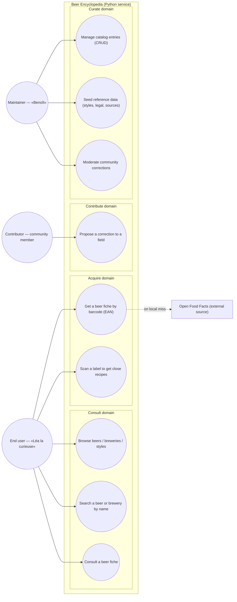

# Use case diagram — beer-encyclopedia — knowledge base & scan

> **Feature**: beer-encyclopedia backend (knowledge base + label scan)
> **Source code**: `api/routers/`, `ml/pipeline.py`, `importers/`
> **Related ADRs**: ADR-0002 (legal FR), ADR-0003 (Open Food Facts connector),
> repo ADR-0005 (backend split)

## Context

Retro-documentation of the **as-built** encyclopedia backend. Groups actor goals
**by domain** (Consult / Acquire / Contribute / Curate), not by backend package —
the Mobile/NestJS/Python decomposition lives in `03-component.md`.

This diagram covers only what the Python service exposes today. The future
panoramic-scan + AI-enrichment pipeline is modelled elsewhere (`docs/architecture/diagrams/scan/`)
and is explicitly out of scope here.

## Diagram

## Notes

- **Built today**: UC1–UC5 (read + search + `POST /beers/import-by-ean` + `POST /scan`),
  UC7 (CRUD on `/beers`, `/breweries`), UC8 (seed scripts `seed_styles` /
  `seed_legal_denominations` / `seed_sources`).
- **Modelled but no endpoint yet**: UC6 and UC9 — the `community_corrections` table
  exists (`db/models/correction.py`) but no API surface is exposed. Kept here because
  the persistence is built and the moderation goal is the table's reason to exist.
- UML 2.5: every node is an **actor-initiated goal**. Open Food Facts is an external
  data source on the boundary (a trigger target of UC4), never an actor with a goal.
- UC4 is the actor's goal "obtain a fiche from a barcode"; the DB-first→OFF fallback is
  a sequence detail, see `02-sequence-import-by-ean.md`.
