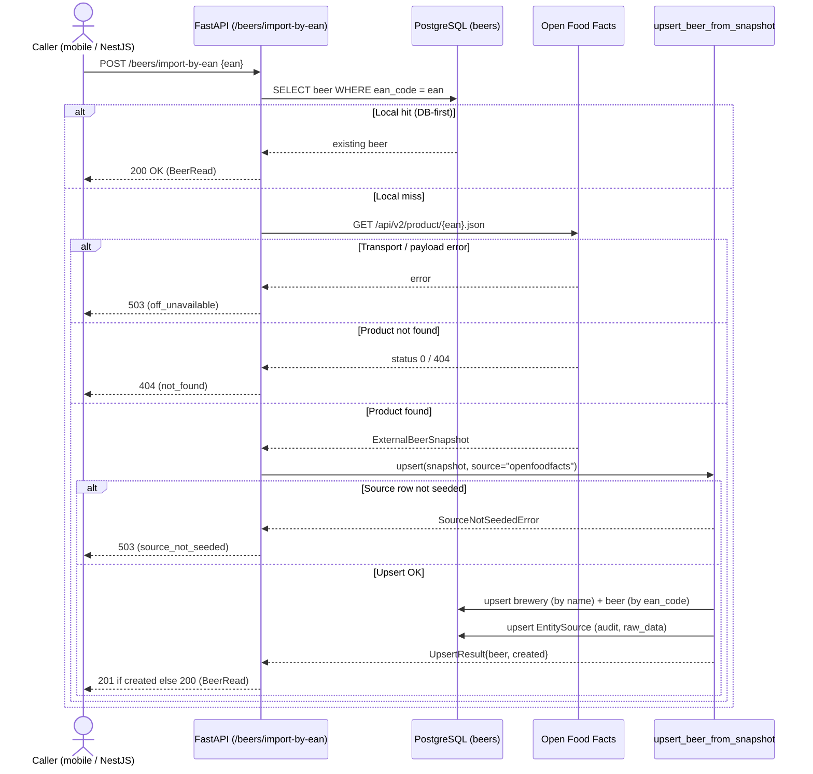

# Sequence diagram — beer-encyclopedia — import a beer by EAN

> **Feature**: `POST /beers/import-by-ean`
> **Source code**: `api/routers/beers.py`, `importers/openfoodfacts.py`,
> `importers/persistence.py`
> **Related ADRs**: ADR-0003 (Open Food Facts connector)

## Context

The DB-first import scenario as actually coded. Shows the four HTTP outcomes
(200 / 201 / 404 / 503) and the conservative upsert + audit-trail write. Field
mapping and refresh policy are summarized in the notes, not duplicated here.

## Diagram

## Notes

- **DB-first** (`api/routers/beers.py`): a local `ean_code` hit returns 200 without
  any network call — Open Food Facts is only queried on a miss.
- **Conservative refresh** (`importers/persistence.py`): a re-import never overwrites
  hand-edited fields (`name`, `slug`, `description`, `style_id`, `legal_denomination`)
  and never clears a field — it only writes a value the snapshot actually carries.
- **Audit trail**: every successful import upserts an `EntitySource` row keyed by
  `(source_id, entity_type='beer', external_id=ean)`, keeping the raw OFF payload in
  `raw_data`.
- **Seed dependency**: the `openfoodfacts` row must exist in `sources` (via
  `scripts/seed_sources.py`) or the import surfaces as 503, not a silent failure.
